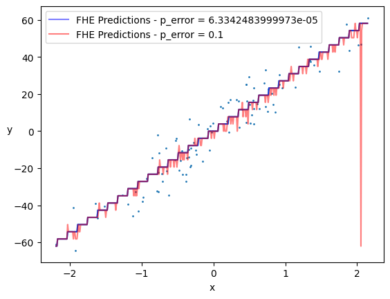

# Advanced Features

Concrete-ML offers some features for advanced users that we detail here.

## Approximate Computations Using The `p_error` Parameter

In Concrete-ML, we make use of table lookup (TLU) to represent any non-linear operation (e.g. sigmoid). This TLU is then used to achieve a Programmable Bootstrapping (PBS) operation that will apply the non-linear operation in the cryptographic realm.

This operation is set to a specific error probability in Concrete-ML:

```python
DEFAULT_P_ERROR_PBS = 6.3342483999973e-05
```

A single PBS operation has `1 - DEFAULT_P_ERROR_PBS = 99.9936657516%` chances of being correct. This number plays a role in the cryptographic parameters. As such, the lower the `p_error` the more constraining they will become. This has an impact on the both the keygen and, more importantly, on the Fully Homomorphic Encryption (FHE) execution time.

This number is set by default to be relatively low such that any user can build deep circuits without being impacted by this noise. However, there might be use cases and specific circuits where the gaussian noise can increase without being too dramatic for the circuit accuracy. In that case, increasing the `p_error` can be relevant as it will reduce the execution time in FHE.

Here is a visualization of the effect of the `p_error` over a simple linear regression with a `p_error = 0.1` vs the default `p_error` value:



The execution for the two models are 336 ms per example for the standard `p_error` and 253 ms per example for a `p_error = 0.1` (on a 8 cores Intel CPU machine). Obviously, this speed up is very dependent on the model complexity. We advise advanced users to test the effect of the `p_error` in terms of both execution time and accuracy as there is no easy rule to set it.
