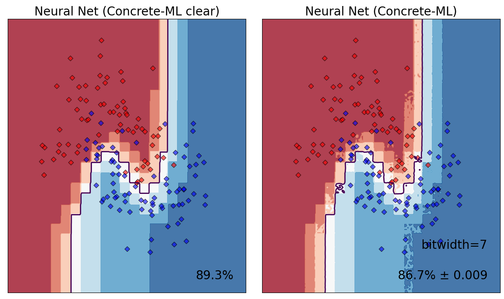

# Advanced Features

Concrete-ML offers some features for advanced users that wish to adjust the cryptographic parameters that are generated by the Concrete stack for a certain machine learning model.

## Approximate computations

### Probability of errors

Concrete-ML makes use of table lookups (TLUs) to represent any non-linear operation (e.g. sigmoid). TLUs are implemented through the Programmable Bootstrapping (PBS) operation which will apply a non-linear operation in the cryptographic realm.

The result of TLU operations is obtained with a specific error probability. Concrete-ML offers the possibility to set this error probability, which influences the cryptographic parameters. The higher the success rate, the more restrictive the parameters become. This can affect both key generation and, more significantly, FHE execution time.

In Concrete-ML, there are three different ways to define the error probability:

- setting `p_error`, the error probability of an individual TLU (see [here](advanced_features.md#an-error-probability-for-an-individual-tlu))
- setting `global_p_error`, the error probability of the full circuit (see [here](advanced_features.md#a-global-error-probability-for-the-entire-model))
- not setting `p_error` nor `global_p_error`, and using default parameters (see [here](advanced_features.md#using-default-error-probability))


`p_error` and `global_p_error` are somehow two concurrent parameters, in the sense they both have an impact on the choice of cryptographic parameters. To avoid a mistake, it is forbidden in Concrete-ML to set both `p_error` and `global_p_error`simultaneously.


### An error probability for an individual TLU

The first way to set error probabilities in Concrete-ML is at the local level, by directly setting the probability of error of each individual TLU. This probability is referred to as `p_error`. A given PBS operation has a `1 - p_error` chance of being successful. The successful evaluation here means that the value decrypted after FHE evaluation is exactly the same as the one that one would compute in the clear.

For simplicity, it is best to use [default options](advanced_features.md#using-default-error-probability), irrespective of the type of model. However, especially for deep neural networks, default values may be too pessimistic, reducing computation speed without any improvement in accuracy. For deep neural networks, some TLU errors may not have any impact on accuracy and the `p_error` can be safely increased (see for example CIFAR classifications in [our showcase](../getting-started/showcase.md)).

Here is a visualization of the effect of the `p_error` on a neural network model with a `p_error = 0.1` compared to execution in the clear (i.e. no error):



Varying the `p_error` in the one hidden-layer neural network above produces the following inference times. Increasing `p_error` to 0.1 halves the inference time with respect to a `p_error` of 0.001. Note, in the graph above, that the decision boundary becomes noisier with higher `p_error`.

| p_error | Inference Time (ms) |
| :-----: | ------------------- |
|  0.001  | 0.80                |
|  0.01   | 0.41                |
|   0.1   | 0.37                |

The speedup is dependent on model complexity, but, in an iterative approach, it is possible to search for a good value of `p_error` to obtain a speedup while maintaining good accuracy. Currently, no heuristic has been proposed to find a good value _a priori_.

Users have the possibility to change this `p_error` as they see fit, by passing an argument to the `compile` function of any of the models. Here is an example:

```python
from concrete.ml.sklearn import XGBClassifier
from sklearn.datasets import make_classification
from sklearn.model_selection import train_test_split

x, y = make_classification(n_samples=100, class_sep=2, n_features=4, random_state=42)

# Retrieve train and test sets
X_train, _, y_train, _ = train_test_split(x, y, test_size=10, random_state=42)

clf = XGBClassifier()
clf.fit(X_train, y_train)

# Here we set the p_error parameter
clf.compile(X_train, p_error = 0.1)
```

If the `p_error` value is specified and the [Virtual Library](compilation.md#simulation-with-the-virtual-library) is enabled, the run will take into account the randomness induced by the `p_error`, resulting in statistical similarity to the FHE evaluation.

### A global error probability for the entire model

A `global_p_error` is also available and defines the probability of success for the entire model. Here, the `p_error` for every PBS is computed internally in Concrete-Numpy such that the `global_p_error` is reached.

There might be cases where the user encounters a `No cryptography parameter found` error message. In such a case, increasing the `p_error` or the `global_p_error` might help.

Usage is similar to the `p_error` parameter:

<!--pytest-codeblocks:cont-->

```python
# Here we set the global_p_error parameter
clf.compile(X_train, global_p_error = 0.1)
```

In the above example, XGBoostClassifier in FHE has a 1/10 probability to have a shifted output value compared to the expected value. Note that the shift is relative to the expected value, so even if the result is different, it should be **around** the expected value.


The `global_p_error` parameter is only used for FHE evaluation and has **no** effect on VL simulation (unlike the `p_error`). Fixing it is in our roadmap.


### Using default error probability

If neither `p_error` or `global_p_error` are set, Concrete-ML takes a default `global_p_error = 0.01`.

### Using a rounding operator to approximate operations for faster computations

To speed-up neural networks, a rounding operator can be used at a fixed bit-width value. This involves applying the rounding operator to intermediate values in the neural network to retain only the most significant $$P$$ bits, where $$P$$ is the desired precision for the subsequent TLU.

The rounding operation is defined as follows:

First, compute $$t$$ as the difference between $$L$$, the actual bit-width of the accumulator, and $$P$$:

$$t = L - P$$

Then, the rounding operation can be computed as:

$$ \mathrm{round\_to\_t\_bits}(x, t) = \left\lfloor  \frac{x}{2^t} \right\rceil \cdot 2^t $$

where $x$ is the input number, and $\lfloor \cdot \rceil$ denotes the operation that rounds to the nearest integer.

In Concrete-ML, this feature is currently implemented for custom neural networks through the compile functions, including

- `concrete.ml.torch.compile_torch_model`,
- `concrete.ml.torch.compile_onnx_model` and
- `concrete.ml.torch.compile_brevitas_qat_model`.

using `rounding_threshold_bits` argument which can be set to a specific bit-width. It is important to choose an appropriate bit-width threshold to balance the trade-off between speed and accuracy. By reducing the bit-width of intermediate tensors, we can speed-up computations while maintaining accuracy to some extent.


The `rounding_threshold_bits` parameter only works in FHE for bit-width **less or equal to 8 bits**.


To find the best trade-off between speed and accuracy, it is recommended to experiment with different thresholds and check the accuracy on an evaluation set after compiling the model.

In practice, the process would look like this:

1. Set a `rounding_threshold_bits` to a relatively high $$P$$. Say, 8 bits.
1. Check the accuracy
1. Update P = P - 1
1. repeat 2. and 3. until th accuracy loss is above a certain, acceptable threshold.

An example of such implementation is available in [evaluate_torch_cml.py](https://github.com/zama-ai/concrete-ml/blob/release/0.6.x/use_case_examples/cifar_brevitas_training/evaluate_one_example_fhe.py) and [CifarInFheWithSmallerAccumulators.ipynb](https://github.com/zama-ai/concrete-ml-internal/blob/main/use_case_examples/cifar_brevitas_finetuning/CifarInFheWithSmallerAccumulators.ipynb)

## Seeing compilation information

By using `verbose_compilation = True` and `show_mlir = True` during compilation, the user receives a lot of information from the compiler and its inner optimizer. These options are, however, mainly meant for power-users, so they may be hard to understand.

```python
from concrete.ml.sklearn import DecisionTreeClassifier
from sklearn.datasets import make_classification
from sklearn.model_selection import train_test_split

x, y = make_classification(n_samples=100, class_sep=2, n_features=4, random_state=42)

# Retrieve train and test sets
X_train, _, y_train, _ = train_test_split(x, y, test_size=10, random_state=42)

clf = DecisionTreeClassifier(random_state=42)
clf.fit(X_train, y_train)

clf.compile(X_train, verbose_compilation=True, show_mlir=True, p_error=0.033)
```

Here, one will see:

- the computation graph, typically

```
Computation Graph
-------------------------------------------------------------------------------------------------------------------------------
 %0 = _inputs                                  # EncryptedTensor<uint6, shape=(1, 4)>           ∈ [0, 63]
 %1 = transpose(%0)                            # EncryptedTensor<uint6, shape=(4, 1)>           ∈ [0, 63]
 %2 = [[0 0 0 1]]                              # ClearTensor<uint1, shape=(1, 4)>               ∈ [0, 1]
 %3 = matmul(%2, %1)                           # EncryptedTensor<uint6, shape=(1, 1)>           ∈ [0, 63]
 %4 = [[32]]                                   # ClearTensor<uint6, shape=(1, 1)>               ∈ [32, 32]
 %5 = less_equal(%3, %4)                       # EncryptedTensor<uint1, shape=(1, 1)>           ∈ [False, True]
 %6 = reshape(%5, newshape=[ 1  1 -1])         # EncryptedTensor<uint1, shape=(1, 1, 1)>        ∈ [False, True]
 %7 = [[[ 1]  [-1]]]                           # ClearTensor<int2, shape=(1, 2, 1)>             ∈ [-1, 1]
 %8 = matmul(%7, %6)                           # EncryptedTensor<int2, shape=(1, 2, 1)>         ∈ [-1, 1]
 %9 = reshape(%8, newshape=[ 2 -1])            # EncryptedTensor<int2, shape=(2, 1)>            ∈ [-1, 1]
%10 = [[1] [0]]                                # ClearTensor<uint1, shape=(2, 1)>               ∈ [0, 1]
%11 = equal(%10, %9)                           # EncryptedTensor<uint1, shape=(2, 1)>           ∈ [False, True]
%12 = reshape(%11, newshape=[ 1  2 -1])        # EncryptedTensor<uint1, shape=(1, 2, 1)>        ∈ [False, True]
%13 = [[[63  0]  [ 0 63]]]                     # ClearTensor<uint6, shape=(1, 2, 2)>            ∈ [0, 63]
%14 = matmul(%13, %12)                         # EncryptedTensor<uint6, shape=(1, 2, 1)>        ∈ [0, 63]
%15 = reshape(%14, newshape=[ 1  2 -1])        # EncryptedTensor<uint6, shape=(1, 2, 1)>        ∈ [0, 63]
return %15
```

- the MLIR, produced by Concrete-Numpy and given to the compiler

```
MLIR
-------------------------------------------------------------------------------------------------------------------------------
module {
  func.func @main(%arg0: tensor<1x4x!FHE.eint<6>>) -> tensor<1x2x1x!FHE.eint<6>> {
    %cst = arith.constant dense<[[[63, 0], [0, 63]]]> : tensor<1x2x2xi7>
    %cst_0 = arith.constant dense<[[1], [0]]> : tensor<2x1xi7>
    %cst_1 = arith.constant dense<[[[1], [-1]]]> : tensor<1x2x1xi7>
    %cst_2 = arith.constant dense<32> : tensor<1x1xi7>
    %cst_3 = arith.constant dense<[[0, 0, 0, 1]]> : tensor<1x4xi7>
    %c32_i7 = arith.constant 32 : i7
    %0 = "FHELinalg.transpose"(%arg0) {axes = []} : (tensor<1x4x!FHE.eint<6>>) -> tensor<4x1x!FHE.eint<6>>
    %cst_4 = tensor.from_elements %c32_i7 : tensor<1xi7>
    %1 = "FHELinalg.matmul_int_eint"(%cst_3, %0) : (tensor<1x4xi7>, tensor<4x1x!FHE.eint<6>>) -> tensor<1x1x!FHE.eint<6>>
    %cst_5 = arith.constant dense<[1, 1, 1, 1, 1, 1, 1, 1, 1, 1, 1, 1, 1, 1, 1, 1, 1, 1, 1, 1, 1, 1, 1, 1, 1, 1, 1, 1, 1, 1, 1, 1, 1, 0, 0, 0, 0, 0, 0, 0, 0, 0, 0, 0, 0, 0, 0, 0, 0, 0, 0, 0, 0, 0, 0, 0, 0, 0, 0, 0, 0, 0, 0, 0]> : tensor<64xi64>
    %2 = "FHELinalg.apply_lookup_table"(%1, %cst_5) : (tensor<1x1x!FHE.eint<6>>, tensor<64xi64>) -> tensor<1x1x!FHE.eint<6>>
    %3 = tensor.expand_shape %2 [[0], [1, 2]] : tensor<1x1x!FHE.eint<6>> into tensor<1x1x1x!FHE.eint<6>>
    %4 = "FHELinalg.matmul_int_eint"(%cst_1, %3) : (tensor<1x2x1xi7>, tensor<1x1x1x!FHE.eint<6>>) -> tensor<1x2x1x!FHE.eint<6>>
    %5 = tensor.collapse_shape %4 [[0, 1], [2]] : tensor<1x2x1x!FHE.eint<6>> into tensor<2x1x!FHE.eint<6>>
    %6 = "FHELinalg.add_eint_int"(%5, %cst_4) : (tensor<2x1x!FHE.eint<6>>, tensor<1xi7>) -> tensor<2x1x!FHE.eint<6>>
    %cst_6 = arith.constant dense<"0x00000000000000000000000000000000000000000000000000000000000000000000000000000000000000000000000000000000000000000000000000000000000000000000000000000000000000000000000000000000000000000000000000000000000000000000000000000000000000000000000000000000000000000000000000000000000000000000000000000000000000000000000000000000000000000000000000000000000000000000000000000000000000000000000000000000000000000000000000000000000000000000000000000000000000000000000000000000000000000000000000000000000000000000000000000000000000000000000001000000000000000000000000000000000000000000000000000000000000000000000000000000000000000000000000000000000000000000000000000000000000000000000000000000000000000000000000000000000000000000000000000000000000000000000000000000000000000000000000000000000000000000000000000000000000000000000000000000000000000000000000000000000000000000000000000000000000000000000000000000000000000000000000000000000000000000000000000000000000000000000000000000000000000000000000000000000000000000000000000000000000000000000000000000000000000000000000000000000000000000000000000000000000000000000000000000000000000000000000000000000000000000000000000000000000000000000000000000000000000000000000000000000000000000000000000000000000000000000000000000000000000000000000000000000000000000000000000000000000000000000000000000000000000000000000000000000000000000000000000000000000000000000000000000000000000000000000000000000000000000000000000000000000000000000000000000000000000000000000000000000000000000000000000000000000000000000001000000000000000000000000000000000000000000000000000000000000000000000000000000000000000000000000000000000000000000000000000000000000000000000000000000000000000000000000000000000000000000000000000000000000000000000000000000000000000000000000000000000000000000000000000000000000000000000000000000000000000000000000000000000000000000000000000000000000000000000000000000000000000000000000000000000000000000000000000000000000000000000000000000000000000000000000000000000000000000000000000000000000000000000000000000"> : tensor<2x64xi64>
    %cst_7 = arith.constant dense<[[0], [1]]> : tensor<2x1xindex>
    %7 = "FHELinalg.apply_mapped_lookup_table"(%6, %cst_6, %cst_7) : (tensor<2x1x!FHE.eint<6>>, tensor<2x64xi64>, tensor<2x1xindex>) -> tensor<2x1x!FHE.eint<6>>
    %8 = tensor.expand_shape %7 [[0, 1], [2]] : tensor<2x1x!FHE.eint<6>> into tensor<1x2x1x!FHE.eint<6>>
    %9 = "FHELinalg.matmul_int_eint"(%cst, %8) : (tensor<1x2x2xi7>, tensor<1x2x1x!FHE.eint<6>>) -> tensor<1x2x1x!FHE.eint<6>>
    return %9 : tensor<1x2x1x!FHE.eint<6>>
  }
}
```

- information from the optimizer (including cryptographic parameters):

```
Optimizer
-------------------------------------------------------------------------------------------------------------------------------
--- Circuit
  6 bits integers
  7 manp (maxi log2 norm2)
  388ms to solve
--- User config
  3.300000e-02 error per pbs call
  1.000000e+00 error per circuit call
--- Complexity for the full circuit
  4.214000e+02 Millions Operations
--- Correctness for each Pbs call
  1/30 errors (3.234529e-02)
--- Correctness for the full circuit
  1/10 errors (9.390887e-02)
--- Parameters resolution
  1x glwe_dimension
  2**11 polynomial (2048)
  762 lwe dimension
  keyswitch l,b=5,3
  blindrota l,b=2,15
  wopPbs : false
---
```

In this latter optimization, the following information will be provided:

- The bit-width ("6 bits integers") used in the program: for the moment, the compiler only supports a single precision (i.e. that all PBS are promoted to the same bit-width - the largest one). Therefore, this bit-width predominantly drives the speed of the program, and it is essential to attempt to reduce it as much as possible for fast execution.
- The maximal norm2 ("7 manp"), which has an impact on the crypto parameters: The larger this norm2, the slower PBS will be. The norm2 is related to the norm of some constants appearing in your program, in a way which will be clarified in the compiler documentation.
- The probability of error of an individual PBS, which was requested by the user ("3.300000e-02 error per pbs call" in User Config)
- The probability of error of the full circuit, which was requested by the user ("1.000000e+00 error per circuit call" in User Config): Here, the probability 1 stands for "not used", since we had set the individual probability.
- The probability of error of an individual PBS, which is found by the optimizer ("1/30 errors (3.234529e-02)"
- The probability of error of the full circuit which is found by the optimizer ("1/10 errors (9.390887e-02)")
- An estimation of the cost of the circuit ("4.214000e+02 Millions Operations"): Large values indicate a circuit that will execute more slowly.

and, for cryptographers only, some information about cryptographic parameters:

- 1x glwe_dimension
- 2\*\*11 polynomial (2048)
- 762 lwe dimension
- keyswitch l,b=5,3
- blindrota l,b=2,15
- wopPbs : false

Once again, this optimizer feedback is a work in progress and will be modified and improved in future releases.
