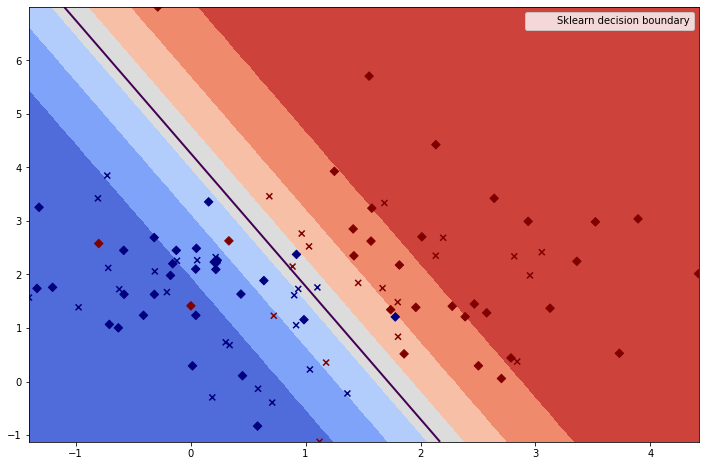
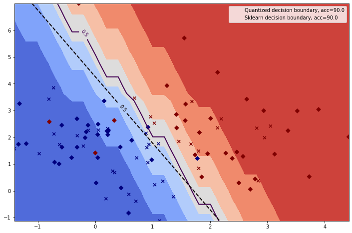

# Linear models

Concrete ML provides several of the most popular linear models for `regression` and `classification` that can be found in [scikit-learn](https://scikit-learn.org/stable/):

|                                             Concrete ML                                              |                                                                         scikit-learn                                                                         |
| :--------------------------------------------------------------------------------------------------: | :----------------------------------------------------------------------------------------------------------------------------------------------------------: |
|   [LinearRegression](../references/api/concrete.ml.sklearn.linear_model.md#class-linearregression)   |    [LinearRegression](https://scikit-learn.org/stable/modules/generated/sklearn.linear_model.LinearRegression.html#sklearn.linear_model.LinearRegression)    |
| [LogisticRegression](../references/api/concrete.ml.sklearn.linear_model.md#class-logisticregression) | [LogisticRegression](https://scikit-learn.org/stable/modules/generated/sklearn.linear_model.LogisticRegression.html#sklearn.linear_model.LogisticRegression) |
|              [LinearSVC](../references/api/concrete.ml.sklearn.svm.md#class-linearsvc)               |                       [LinearSVC](https://scikit-learn.org/stable/modules/generated/sklearn.svm.LinearSVC.html#sklearn.svm.LinearSVC)                        |
|              [LinearSVR](../references/api/concrete.ml.sklearn.svm.md#class-linearsvr)               |                       [LinearSVR](https://scikit-learn.org/stable/modules/generated/sklearn.svm.LinearSVR.html#sklearn.svm.LinearSVR)                        |
|       [PoissonRegressor](../references/api/concrete.ml.sklearn.glm.md#class-poissonregressor)        |    [PoissonRegressor](https://scikit-learn.org/stable/modules/generated/sklearn.linear_model.PoissonRegressor.html#sklearn.linear_model.PoissonRegressor)    |
|       [TweedieRegressor](../references/api/concrete.ml.sklearn.glm.md#class-tweedieregressor)        |    [TweedieRegressor](https://scikit-learn.org/stable/modules/generated/sklearn.linear_model.TweedieRegressor.html#sklearn.linear_model.TweedieRegressor)    |
|         [GammaRegressor](../references/api/concrete.ml.sklearn.glm.md#class-gammaregressor)          |       [GammaRegressor](https://scikit-learn.org/stable/modules/generated/sklearn.linear_model.GammaRegressor.html#sklearn.linear_model.GammaRegressor)       |
|              [Lasso](../references/api/concrete.ml.sklearn.linear_model.md#class-lasso)              |                    [Lasso](https://scikit-learn.org/stable/modules/generated/sklearn.linear_model.Lasso.html#sklearn.linear_model.Lasso)                     |
|              [Ridge](../references/api/concrete.ml.sklearn.linear_model.md#class-ridge)              |                    [Ridge](https://scikit-learn.org/stable/modules/generated/sklearn.linear_model.Ridge.html#sklearn.linear_model.Ridge)                     |
|         [ElasticNet](../references/api/concrete.ml.sklearn.linear_model.md#class-elasticnet)         |             [ElasticNet](https://scikit-learn.org/stable/modules/generated/sklearn.linear_model.ElasticNet.html#sklearn.linear_model.ElasticNet)             |
|       [SGDRegressor](../references/api/concrete.ml.sklearn.linear_model.md#class-sgdregressor)       |                           [SGDRegressor](https://scikit-learn.org/stable/modules/generated/sklearn.linear_model.SGDRegressor.html)                           |

Using these models in FHE is extremely similar to what can be done with scikit-learn's [API](https://scikit-learn.org/stable/modules/classes.html#module-sklearn.linear_model), making it easy for data scientists who have used this framework to get started with Concrete ML.

Models are also compatible with some of scikit-learn's main workflows, such as `Pipeline()` and `GridSearch()`.

## Pre-trained models

It is possible to convert an already trained scikit-learn linear model to a Concrete ML one by using the [`from_sklearn_model`](../references/api/concrete.ml.sklearn.base.md#classmethod-from_sklearn_model) method. See [below for an example](linear.md#loading-a-pre-trained-model). This functionality is only available for linear models.

## Quantization parameters

The `n_bits` parameter controls the bit-width of the inputs and weights of the linear models. When non-linear mapping is applied by the model, such as _exp_ or _sigmoid_, Concrete ML applies it on the client-side, on clear-text values that are the decrypted output of the linear part of the model. Thus, Linear Models do not use table lookups, and can, therefore, use high precision integers for weight and inputs.

The `n_bits` parameter can be set to `8` or more bits for models with up to `300` input dimensions. When the input has more dimensions, `n_bits` must be reduced to `6-7`. All performance metrics are preserved down to `n_bits=6`, compared to the non-quantized float models from scikit-learn.

The same quantization parameters (i.e., scale and zero-point) are applied on all features, so it can be beneficial to make all feature distribution similar by using standard or min-max normalization. For a more detailed comparison of the impact of such pre-processing please refer to [the logistic regression notebook](../advanced_examples/LogisticRegression.ipynb).

## Example

The following snippet gives an example about training a LogisticRegression model on a simple data-set followed by inference on encrypted data with FHE. A more complete example can be found in the [LogisticRegression notebook](../tutorials/ml_examples.md).

```python
from sklearn.datasets import make_classification
from sklearn.model_selection import train_test_split

from concrete.ml.sklearn import LogisticRegression

# Create the data for classification:
X, y = make_classification(
    n_features=30,
    n_redundant=0,
    n_informative=2,
    random_state=2,
    n_clusters_per_class=1,
    n_samples=250,
)

# Retrieve train and test sets:
X_train, X_test, y_train, y_test = train_test_split(X, y, test_size=0.4, random_state=42)

# Instantiate the model:
model = LogisticRegression(n_bits=8)

# Fit the model:
model.fit(X_train, y_train)

# Evaluate the model on the test set in clear:
y_pred_clear = model.predict(X_test)

# Compile the model:
model.compile(X_train)

# Perform the inference in FHE:
y_pred_fhe = model.predict(X_test, fhe="execute")

# Assert that FHE predictions are the same as the clear predictions:
print(
    f"{(y_pred_fhe == y_pred_clear).sum()} examples over {len(y_pred_fhe)} "
    "have an FHE inference equal to the clear inference."
)

# Output:
#  100 examples over 100 have an FHE inference equal to the clear inference
```

We can then plot the decision boundary of the classifier and compare those results with a scikit-learn model executed in clear. The complete code can be found in the [LogisticRegression notebook](../tutorials/ml_examples.md).

 

The overall accuracy scores are identical (93%) between the scikit-learn model (executed in the clear) and the Concrete ML one (executed in FHE). In fact, quantization has little impact on the decision boundaries, as linear models are able to consider large precision numbers when quantizing inputs and weights in Concrete ML. Additionally, as the linear models do not use PBS, the FHE computations are always exact. This means that the FHE predictions are always identical to the quantized clear ones.

## Loading a pre-trained model

An alternative to the example above is to train a scikit-learn model in a separate step and then to convert it to Concrete ML.

```
from sklearn.linear_model import LogisticRegression as SKlearnLogisticRegression

# Instantiate the model:
model = SKlearnLogisticRegression()

# Fit the model:
model.fit(X_train, y_train)

cml_model = LogisticRegression.from_sklearn_model(model, X_train, n_bits=8)

# Compile the model:
cml_model.compile(X_train)

# Perform the inference in FHE:
y_pred_fhe = cml_model.predict(X_test, fhe="execute")


```
