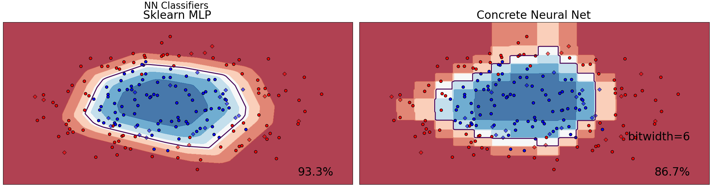

# Neural networks

This document introduces the simple built-in neural networks models that Concrete ML provides with a scikit-learn interface through the `NeuralNetClassifier` and `NeuralNetRegressor` classes.

## Supported models

|                                          Concrete ML                                          | scikit-learn                                                                                                 |
| :-------------------------------------------------------------------------------------------: | ------------------------------------------------------------------------------------------------------------ |
| [NeuralNetClassifier](../references/api/concrete.ml.sklearn.qnn.md#class-neuralnetclassifier) | [MLPClassifier](https://scikit-learn.org/stable/modules/generated/sklearn.neural_network.MLPClassifier.html) |
|  [NeuralNetRegressor](../references/api/concrete.ml.sklearn.qnn.md#class-neuralnetregressor)  | [MLPRegressor](https://scikit-learn.org/stable/modules/generated/sklearn.neural_network.MLPRegressor.html)   |

The neural network models are implemented with [skorch](https://skorch.readthedocs.io/en/stable/index.html), which provides a scikit-learn-like interface to Torch models (more [here](../explanations/inner-workings/external_libraries.md#skorch)).

Concrete ML models are multi-layer, fully-connected, networks with customizable activation functions and have a number of neurons in each layer. This approach is similar to what is available in scikit-learn when using the `MLPClassifier`/`MLPRegressor` classes. The built-in models train easily with a single call to `.fit()`, which will automatically quantize weights and activations. These models use Quantization Aware Training, allowing good performance for low precision (down to 2-3 bits) weights and activations.

While `NeuralNetClassifier` and `NeuralNetClassifier` provide scikit-learn-like models, their architecture is somewhat restricted to make training easy and robust. If you need more advanced models, you can convert custom neural networks as described in the [FHE-friendly models documentation](../deep-learning/fhe_friendly_models.md).


Good quantization parameter values are critical to make models [respect FHE constraints](../getting-started/concepts.md#model-accuracy-considerations-under-fhe-constraints). Weights and activations should be quantized to low precision (e.g., 2-4 bits). The sparsity of the network can be tuned [as described below](neural-networks.md#overflow-errors) to avoid accumulator overflow.



Using `nn.ReLU` as the activation function benefits from an optimization where [quantization uses powers-of-two scales](../explanations/quantization.md#quantization-special-cases). This results in much faster inference times in FHE, thanks to a TFHE primitive that performs fast division by powers of two.


## Example

To create an instance of a Fully Connected Neural Network (FCNN), you need to instantiate one of the `NeuralNetClassifier` and `NeuralNetRegressor` classes and configure a number of parameters that are passed to their constructor.

Note that some parameters need to be prefixed by `module__`, while others don't. The parameters related to the model must have the prefix, such as the underlying `nn.Module`. The parameters related to training options do not require the prefix.

```python
from concrete.ml.sklearn import NeuralNetClassifier
import torch.nn as nn

n_inputs = 10
n_outputs = 2
params = {
    "module__n_layers": 2,
    "max_epochs": 10,
}

concrete_classifier = NeuralNetClassifier(**params)
```

The [Classifier Comparison notebook](../tutorials/ml_examples.md) shows the behavior of built-in neural networks on several synthetic data-sets.

The folowing figure shows the Concrete ML neural network trained with Quantization Aware Training in an FHE-compatible configuration and compares it to the floating-point equivalent trained with scikit-learn.



## Architecture parameters

- `module__n_layers`: number of layers in the FCNN.
  - This parameter must be at least 1. Note that this is the total number of layers. For a single, hidden layer NN model, set `module__n_layers=2`
- `module__activation_function`: can be one of the Torch activations (such as nn.ReLU)
  - See the full list of Torch activations [here](../deep-learning/torch_support.md#activation-functions).
  - Neural networks with `nn.ReLU` activation benefit from specific optimizations that make them around 10x faster than networks with other activation functions.

## Quantization parameters

- `n_w_bits` (default 3): number of bits for weights
- `n_a_bits` (default 3): number of bits for activations and inputs
- `n_accum_bits`: maximum accumulator bit-width that is desired
  - By default, this is unbounded, which, for weight and activation bit-width settings, [may make the trained networks fail in compilation](neural-networks.md#overflow-errors). When used, the implementation will attempt to keep accumulators under this bit-width through [pruning](../explanations/pruning.md) (for example, setting some weights to zero).
- `power_of_two_scaling` (default True): forces quantization scales to be powers-of-two
  - When coupled with the ReLU activation, this optimize strongly the FHE inference time.
  - See this [section](../explanations/quantization.md#quantization-special-cases) in the quantization documentation for more details.

### Training parameters (from skorch)

- `max_epochs` (default 10): The number of epochs to train the network
- `verbose` (default: False): Whether to log loss/metrics during training
- `lr` (default 0.001): Learning rate

You can find other parameters from skorch in the [skorch documentation](https://skorch.readthedocs.io/en/stable/classifier.html).

### Advanced parameters

- `module__n_hidden_neurons_multiplier` (default 4): The number of hidden neurons.
  - This parameter will be automatically set proportional to the dimensionality of the input. It controls the proportionality factor. This value gives good accuracy while avoiding accumulator overflow.
  - See the [pruning](../explanations/pruning.md) and [quantization](../explanations/quantization.md) sections for more info.

### Class weights

You can give weights to each class to use in training. Note that this must be supported by the underlying PyTorch loss function.

<!--pytest-codeblocks:skip-->

```python
    from sklearn.utils.class_weight import compute_class_weight
    params["criterion__weight"] = compute_class_weight("balanced", classes=classes, y=y_train)
```

### Overflow errors

The `n_accum_bits` parameter influences training accuracy by controlling the number of non-zero neurons allowed in each layer. You can increase `n_accum_bits` to improve accuracy, but must consider the precision limitations to avoid an overflow in the accumulator. The default value is a balanced choice that generally avoids overflow, but you may need to adjust it to reduce the network breadth if you encounter overflow errors.

The number of neurons in intermediate layers is controlled by the `n_hidden_neurons_multiplier` parameter. A value of 1 makes intermediate layers have the same number of neurons as the number as the input data dimensions.
