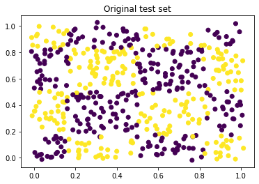
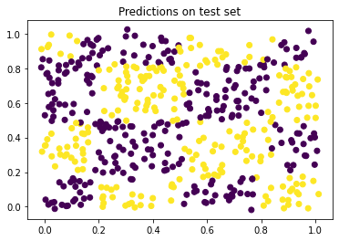
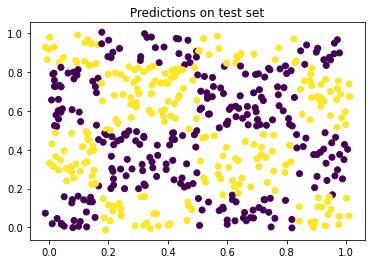

# Developing Custom Models

While **Concrete-ML** provides many built-in models, it is also possible to compile models with custom architecture, for which the user handles the training. In this usage scenario, the user is responsible for training a model that is compatible with [FHE constraints](fhe_constraints.md) and **Concrete-ML** will compile the trained model to FHE.

A common scenario where this usage is recommended is deep neural networks. While simple [neural networks are supported for training](quantized_neural_networks.md) directly in **Concrete-ML**, there exists a wide variety of neural network architectures. To run them in FHE, they must be imported by **Concrete-ML** after they are trained.

In this section we discuss how to use torch to design such models, focusing on deep neural networks.

## Dataset

We generate a synthetic 2D dataset with a checkerboard grid pattern of 100 x 100 points and we split it into 9500 train examples and
500 test examples.



## Importing a torch model

First, we show how to compile a simple torch model that implements a fully connected neural network with two hidden units. Due to its small size, making this model respect FHE constraints is relatively easy. Let's define the model architecture:

```python
from torch import nn
import torch

N_FEAT = 2
class SimpleNet(nn.Module):
    """Simple MLP with torch"""

    def __init__(self, n_hidden=30):
        super().__init__()
        self.fc1 = nn.Linear(in_features=N_FEAT, out_features=n_hidden)
        self.fc2 = nn.Linear(in_features=n_hidden, out_features=n_hidden)
        self.fc3 = nn.Linear(in_features=n_hidden, out_features=2)


    def forward(self, x):
        """Forward pass."""
        x = torch.relu(self.fc1(x))
        x = torch.relu(self.fc2(x))
        x = self.fc3(x)
        return x

```

Once the model is trained, we can import it in **Concrete-ML**, a process that applies quantization and performs the compilation to FHE. This is done through the `compile_torch_model` function. Note that we quantize this model using 3 bits for both weights and activations.

```{note}
In this usage of the `compile_torch_model` function, the quantization will be performed post-training. Thus the weights that were trained in floating point will become integer values.
```

<!--pytest-codeblocks:cont-->

```python
from concrete.ml.torch.compile import compile_torch_model
import numpy
torch_input = torch.randn(100, N_FEAT)
torch_model = SimpleNet(30)
quantized_numpy_module = compile_torch_model(
    torch_model, # our model
    torch_input, # a representative inputset to be used for both quantization and compilation
    n_bits = 3,
)
```

Now the model is ready to infer in FHE. To call the inference functions you first need to quantize the test data:

<!--pytest-codeblocks:cont-->

```python
x_test = numpy.array([numpy.random.randn(N_FEAT)])
x_test_quantized = quantized_numpy_module.quantize_input(x_test)
```

You can then call

- `quantized_numpy_module.forward_and_dequant()` to compute predictions in the clear,
  on quantized data and then de-quantize the result. The return value of this function contains
  the dequantized (float) output of running the model in the clear. Calling the forward
  function on the clear data is useful when debugging.
  The results in FHE will be the same as those on clear quantized data.

- `quantized_numpy_module.forward_fhe.encrypt_run_decrypt()` to perform the FHE inference.
  In this case, de-quantization is done in a second stage using
  `quantized_numpy_module.dequantize_output()`.

We trained this network for three different numbers of hidden layer neurons, quantized it and compiled it to FHE.
We then used the [FHE assistant](fhe_assistant.md) to get the observed accumulator size. We report the mean accumulator size for 10 networks trained in each setting.

Results for the network in fp32:

| neurons               | 10     | 30     | 100    |
| --------------------- | ------ | ------ | ------ |
| fp32 accuracy         | 68.70% | 83.32% | 88.06% |
| 3bit accuracy         | 56.44% | 55.54% | 56.50% |
| mean accumulator size | 6.6    | 6.9    | 7.4    |

Note that fp32 accuracy increases with the number of hidden neurons, but 3-bit accuracy is low and does not change with respect to the number of neurons. The accumulator size increases with the number of neurons. While all the configurations tried
here were FHE compatible (accumulator $\lt$ 8 bits), it is sometimes preferable to have lower
accumulator size in order for the inference time to be lower.

We show here the predictions for the 100 neuron network:



In the following sections we show how to increase quantized accuracy while keeping the accumulator size low.

## Pruning using torch

In the above example we implemented an FCNN model and quantized it to 3 bits. We note that, when there are few neurons on the hidden layers, the accuracy of the model is lower. However, when we have more neurons, we obtained good accuracy but the bitwidth  increased proportionally. Thus, we run the risk of overflowing the maximum allowed FHE accumulator bitwidth.

```{note}
The `Linear` layer computes a dot product between weights and inputs:

$y = \sum_i w_i x_i$

Let's examine a theoretical setting, using 2 bits for weights and layer inputs/outputs. With 2 bits we are ensured that no overflow can occur during the computation of the `Linear` layer if the number of neurons does not exceed 14: the sum of 14 products of 2-bit numbers does not exceed 7 bits. As, by default, **Concrete-ML** uses symmetric quantization for model weights, weight values are in the interval: $\left[-2^{n_{bits}-1}, 2^{n_{bits}-1}-1\right]$. For example, for $n_{bits}=2$ the possible values are $[-2, -1, 0, 1]$, for $n_{bits}=3$ the values can be $[-4,-3,-2,-1,0,1,2,3]$. 

However, in a typical setting, the weights will not all have the maximum or minimum value (e.g. $-2^{n_{bits}-1}$). Weights typically have a normal distribution around 0, which is one of the motivating factors for their symmetric quantization. A symmetric distribution and many zero-valued weights are desirable because opposite sign weights can cancel each other out and zero weights do not increase the accumulator size.
```

We would thus like to train a network with many neurons, to increase the robustness of the training step, all the while having a low number of non-zero neurons. Neural network pruning, [described summarily here](pruning.md) is a training technique that allows the model developer to impose the number of zero-valued weights. Luckily torch [provides tools to prune neural networks](https://pytorch.org/tutorials/intermediate/pruning_tutorial.html).

We modify the network above to customize the number of neurons and to add the possibility to perform pruning:

<!--pytest-codeblocks:cont-->

```python

import torch.nn.utils.prune as prune

class PrunedSimpleNet(SimpleNet):
    """Simple MLP with torch"""

    def prune(self, max_non_zero, enable):
        # Linear layer weight has dimensions NumOutputs x NumInputs
        for layer in self.named_modules():
            if isinstance(layer, nn.Linear):
                num_zero_weights = (layer.weight.shape[1] - max_non_zero) * layer.weight.shape[0]
                if num_zero_weights <= 0: 
                    continue
                
                if enable:
                    prune.l1_unstructured(layer, "weight", amount=num_zero_weights)
                else:
                    prune.remove(layer, "weight")
```

Results with `PrunedSimpleNet`, a pruned version of the `SimpleNet` with 100 neurons on the hidden layers are given below:

| non-zero neurons      | 10     | 30     |
| --------------------- | ------ | ------ |
| fp32 accuracy         | 82.50% | 88.06% |
| 3bit accuracy         | 57.74% | 57.82% |
| mean accumulator size | 6.6    | 6.8    |

We can see that the fp32 accuracy has been improved while maintaining constant mean accumulator size.

```{note}
The accumulator size is determined by **Concrete Numpy** as being the maximum bitwidth encountered anywhere in the encrypted circuit
```

When pruning a larger neural network during training, it is easier to obtain a low a bitwidth accumulator while maintaining better final accuracy. Thus, pruning is more robust than training a similar smaller network.

## Quantization Aware Training

Now that the training has been made more robust through pruning: the accuracy is good in floating point. However, the experiments above show that the
network, once quantized post-training, has low accuracy. Indeed, extreme (low-bit) post-training quantization of a network with more than a few neurons
gives bad performance. The [quantization documentation](quantization.md) gives a description of the
possible ways to quantize a network. Performing quantization during training (Quantization Aware Training - QAT) produces
better accuracy models, at the cost of increased complexity of the training step.

To train the network using QAT, we make use of [brevitas](https://github.com/Xilinx/brevitas), a third party QAT tool. We re-implement
the network above using brevitas, changing `Linear` layers to `QuantLinear` and adding
quantizers on the inputs of linear layers (using `QuantIdentity`).

```{note}
The quantization-aware training (QAT) import tool in **Concrete-ML** is a work in progress. While we tested
it with some networks built with brevitas it's possible to use other tools to obtain QAT networks. 
```

<!--pytest-codeblocks:cont-->

```python
import brevitas.nn as qnn


from brevitas.core.bit_width import BitWidthImplType
from brevitas.core.quant import QuantType
from brevitas.core.restrict_val import FloatToIntImplType, RestrictValueType
from brevitas.core.scaling import ScalingImplType
from brevitas.core.zero_point import ZeroZeroPoint
from brevitas.inject import ExtendedInjector
from brevitas.quant.solver import ActQuantSolver, WeightQuantSolver
from dependencies import value

# Configure quantization options
class CommonQuant(ExtendedInjector):
    bit_width_impl_type = BitWidthImplType.CONST
    scaling_impl_type = ScalingImplType.CONST
    restrict_scaling_type = RestrictValueType.FP
    zero_point_impl = ZeroZeroPoint
    float_to_int_impl_type = FloatToIntImplType.ROUND
    scaling_per_output_channel = False
    narrow_range = True
    signed = True

    @value
    def quant_type(bit_width):
        if bit_width is None:
            return QuantType.FP
        elif bit_width == 1:
            return QuantType.BINARY
        else:
            return QuantType.INT

# Quantization options for weights/activations
class CommonWeightQuant(CommonQuant, WeightQuantSolver):
    scaling_const = 1.0
    signed = True


class CommonActQuant(CommonQuant, ActQuantSolver):
    min_val = -1.0
    max_val = 1.0

class QATPrunedSimpleNet(nn.Module):
    def __init__(self, n_hidden):
        super(QATPrunedSimpleNet, self).__init__()

        n_bits = 3
        self.quant_inp = qnn.QuantIdentity(
            act_quant=CommonActQuant,
            bit_width=n_bits,
            return_quant_tensor=True,
        )

        self.fc1 = qnn.QuantLinear(
            N_FEAT,
            n_hidden,
            True,
            weight_quant=CommonWeightQuant,
            weight_bit_width=n_bits,
            bias_quant=None,
        )

        self.q1 = qnn.QuantIdentity(
            act_quant=CommonActQuant, bit_width=n_bits, return_quant_tensor=True
        )

        self.fc2 = qnn.QuantLinear(
            n_hidden,
            n_hidden,
            True,
            weight_quant=CommonWeightQuant,
            weight_bit_width=3,
            bias_quant=None
        )

        self.q2 = qnn.QuantIdentity(
            act_quant=CommonActQuant, bit_width=n_bits, return_quant_tensor=True
        )

        self.fc3 = qnn.QuantLinear(
            n_hidden,
            2,
            True,
            weight_quant=CommonWeightQuant,
            weight_bit_width=n_hidden,
            bias_quant=None,  
        )

        for m in self.modules():
            if isinstance(m, qnn.QuantLinear):
                torch.nn.init.uniform_(m.weight.data, -1, 1)

    def forward(self, x):
        x = self.quant_inp(x)
        x = self.q1(torch.relu(self.fc1(x)))
        x = self.q2(torch.relu(self.fc2(x)))
        x = self.fc3(x)
        return x

    def prune(self, max_non_zero, enable):
        # Linear layer weight has dimensions NumOutputs x NumInputs
        for name, layer in self.named_modules():
            if isinstance(layer, nn.Linear):
                num_zero_weights = (layer.weight.shape[1] - max_non_zero) * layer.weight.shape[0]
                if num_zero_weights <= 0: 
                    continue
                
                if enable:
                    print(f"Pruning layer {name} factor {num_zero_weights}")
                    prune.l1_unstructured(layer, "weight", amount=num_zero_weights)
                else:
                    prune.remove(layer, "weight")
```

Training this network, with 30 non-zero neurons out of 100 total, gives the following results:

| non-zero neurons                 | 30    |
| -------------------------------- | ----- |
| 3bit accuracy brevitas           | 94.4% |
| 3bit accuracy in **Concrete-ML** | 91.8% |
| accumulator size                 | 7     |

We now have a network that has good accuracy and is FHE compatible (accumulator size $\leq 8$).
Here are the predictions on the test set for this quantization aware trained network:



```{note}
The torch QAT training loop is the same as the standard floating point training loop, but hyperparameters
such as learning rate might need to be adjusted.
```

```{note}
Quantization Aware Training is somewhat slower thant normal training. QAT introduces quantization
during both the forward and backward passes. The quantization process is inefficient on GPUs as its
computational intensity is low with respect to data transfer time.
```
