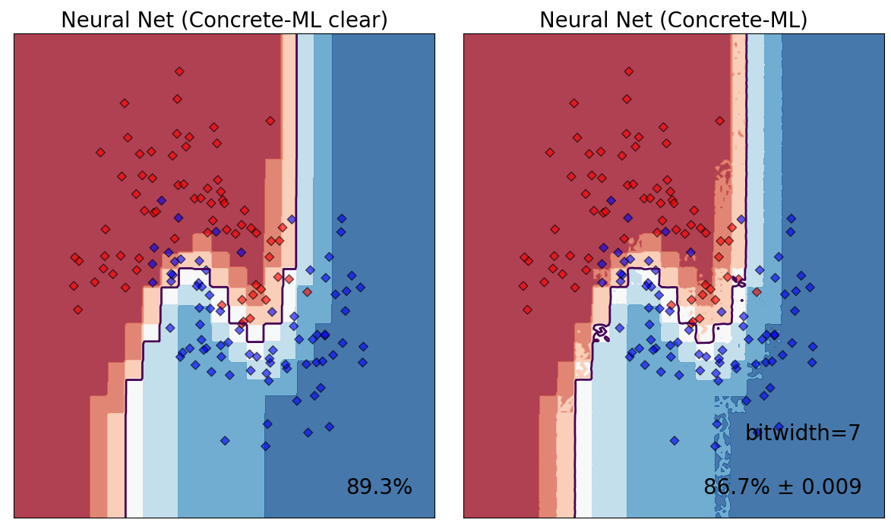

# Advanced features

Concrete ML provides features for advanced users to adjust cryptographic parameters generated by the Concrete stack. This allows users to identify the best trade-off between latency and performance for their specific machine learning models.

## Approximate computations

Concrete ML makes use of table lookups (TLUs) to represent any non-linear operation (e.g., a sigmoid). TLUs are implemented through the Programmable Bootstrapping (PBS) operation, which applies a non-linear operation in the cryptographic realm.

The result of TLU operations is obtained with a specific tolerance to off-by-one errors. Concrete ML offers the possibility to set the probability of such errors occurring, which influences the cryptographic parameters. The lower the tolerance, the more restrictive the parameters become, making both key generation and, more significantly, FHE execution time slower.


Concrete ML has a _simulation_ mode where the impact of approximate computation of TLUs on the model accuracy can be determined. The simulation is much faster, speeding up model development significantly. The behavior in simulation mode is representative of the behavior of the model on encrypted data.


In Concrete ML, there are three different ways to define the tolerance to off-by-one errors for each TLU operation:

- setting `p_error`, the error probability of an individual TLU (see [here](advanced_features.md#tolerance-to-off-by-one-error-for-an-individual-tlu))
- setting `global_p_error`, the error probability of the full circuit (see [here](advanced_features.md#a-global-tolerance-for-one-off-errors-for-the-entire-model))
- not setting `p_error` nor `global_p_error`, and using default parameters (see [here](advanced_features.md#using-default-error-probability))


`p_error` and `global_p_error` cannot be set at the same time, as they are incompatible with each other.


### Tolerance to off-by-one error for an individual TLU

The first way to set error probabilities in Concrete ML is at the local level, by directly setting the tolerance to error of each individual TLU operation (such as activation functions for a neuron output). This tolerance is referred to as `p_error`. A given PBS operation has a `1 - p_error` chance of being correct 100% of the time. The successful evaluation here means that the value decrypted after FHE evaluation is exactly the same as the one that would be computed in the clear. Otherwise, off-by-one errors might occur, but, in practice, these errors are not necessarily problematic if they are sufficiently rare.

For simplicity, it is best to use [default options](advanced_features.md#using-default-error-probability), irrespective of the type of model. Especially for deep neural networks, default values may be too pessimistic, reducing computation speed without any improvement in accuracy. For deep neural networks, some TLU errors might not affect the accuracy of the network, so `p_error` can be safely increased (e.g., see CIFAR classifications in [our showcase](../tutorials/showcase.md)).

Here is a visualization of the effect of the `p_error` on a neural network model with a `p_error = 0.1` compared to execution in the clear (i.e., no error):



Varying `p_error` in the one hidden-layer neural network above produces the following inference times. Increasing `p_error` to 0.1 halves the inference time with respect to a `p_error` of 0.001. In the graph above, the decision boundary becomes noisier with a higher `p_error`.

| p_error | Inference Time (ms) |
| :-----: | ------------------- |
|  0.001  | 0.80                |
|  0.01   | 0.41                |
|   0.1   | 0.37                |

The speedup depends on model complexity, but, in an iterative approach, it is possible to search for a good value of `p_error` to obtain a speedup while maintaining good accuracy. Concrete ML provides a tool to find a good value for `p_error` based on [binary search](advanced_features.md#searching-for-the-best-error-probability).

Users have the possibility to change this `p_error` by passing an argument to the `compile` function of any of the models. Here is an example:

```python
from concrete.ml.sklearn import XGBClassifier
from sklearn.datasets import make_classification
from sklearn.model_selection import train_test_split

x, y = make_classification(n_samples=100, class_sep=2, n_features=4, random_state=42)

# Retrieve train and test sets
X_train, _, y_train, _ = train_test_split(x, y, test_size=10, random_state=42)

clf = XGBClassifier()
clf.fit(X_train, y_train)

# Here we set the p_error parameter
clf.compile(X_train, p_error=0.1)
```

If the `p_error` value is specified and [simulation](compilation.md#fhe-simulation) is enabled, the run will take into account the randomness induced by the choice of `p_error`. This results in statistical similarity to the FHE evaluation.

### A global tolerance for one-off-errors for the entire model

A `global_p_error` is also available and defines the probability of 100% correctness for the entire model, compared to execution in the clear. In this case, the `p_error` for every TLU is determined internally in Concrete such that the `global_p_error` is reached for the whole model.

There might be cases where the user encounters a `No cryptography parameter found` error message. Increasing the `p_error` or the `global_p_error` in this case might help.

Usage is similar to the `p_error` parameter:

<!--pytest-codeblocks:cont-->

```python
# Here we set the global_p_error parameter
clf.compile(X_train, global_p_error=0.1)
```

In the above example, XGBoostClassifier in FHE has a 1/10 probability to have a one-off output value compared to the expected value. The shift is relative to the expected value, so even if the result is different, it should be **close** to the expected value.

### Using default error probability

If neither `p_error` or `global_p_error` are set, Concrete ML employs `p_error = 2^-40` by default.

### Searching for the best error probability

Currently finding a good `p_error` value _a-priori_ is not possible, as it is difficult to determine the impact of the TLU error on the output of a neural network. Concrete ML provides a tool to find a good `p_error` value that improves inference speed while maintaining accuracy. The method is based on binary search and evaluates the latency/accuracy trade-off iteratively.

```python
from time import time

from sklearn.datasets import make_classification
from sklearn.metrics import accuracy_score
from sklearn.model_selection import train_test_split

from concrete.ml.search_parameters import BinarySearch
from concrete.ml.sklearn import DecisionTreeClassifier

x, y = make_classification(n_samples=100, class_sep=2, n_features=4, random_state=42)

# Retrieve train and test sets
X_train, _, y_train, _ = train_test_split(x, y, test_size=10, random_state=42)

clf = DecisionTreeClassifier(random_state=42)

# Fit the model
clf.fit(X_train, y_train)

# Compile the model with the default `p_error`
fhe_circuit = clf.compile(X_train)

# Key Generation
fhe_circuit.client.keygen(force=False)

start_time = time()
y_pred = clf.predict(X_train, fhe="execute")
end_time = time()

print(f"With the default p_error≈0, the inference time is {(end_time - start_time) / 60:.2f} s")
# Output: With the default p_error≈0, the inference time is 0.89 s
print(f"Accuracy = {accuracy_score(y_pred, y_train):.2%}")
# Output: Accuracy = 100.00%

# Search for the largest `p_error` that provides
# the best compromise between accuracy and computational efficiency in FHE
search = BinarySearch(estimator=clf, predict="predict", metric=accuracy_score)
p_error = search.run(x=X_train, ground_truth=y_train, max_iter=10)

# Compile the model with the optimal `p_error`
fhe_circuit = clf.compile(X_train, p_error=p_error)

# Key Generation
fhe_circuit.client.keygen(force=False)

start_time = time()
y_pred = clf.predict(X_train, fhe="execute")
end_time = time()

print(
    f"With p_error={p_error:.5f}, the inference time becomes {(end_time - start_time) / 60:.2f} s"
)
# Ouput: With p_error=0.00043, the inference time becomes 0.56 s
print(f"Accuracy = {accuracy_score(y_pred, y_train): .2%}")
# Output: Accuracy = 100.00%
```

With this optimal `p_error`, accuracy is maintained while execution time is improved by a factor of 1.51.

Please note that the default setting for the search interval is restricted to a range of 0.0 to 0.9. Increasing the upper bound beyond this range may result in longer execution times, especially when `p_error≈1`.

## Rounded activations and quantizers

To speed-up neural networks, a _rounding_ operator can be applied on the accumulators of linear and convolution layers to retain the most significant bits on which the activation and quantization is applied. The accumulator is represented using $$L$$ bits, and $$P \leq L$$ is the desired input bit-width of the TLU operation that computes the activation and quantization.

The rounding operation is defined as follows:

First, compute $$t$$ as the difference between $$L$$, the actual bit-width of the accumulator, and $$P$$:

$$t = L - P$$

Then, the rounding operation can be computed as:

$$\mathrm{round\_to\_P\_bits}(x, t) = \left\lfloor \frac{x}{2^t} \right\rceil \cdot 2^t$$

where $$x$$ is the input number, and $$\lfloor \cdot \rceil$$ denotes the operation that rounds to the nearest integer.

In Concrete ML, this feature is currently implemented for custom neural networks through the compile functions, including

- `concrete.ml.torch.compile_torch_model`,
- `concrete.ml.torch.compile_onnx_model` and
- `concrete.ml.torch.compile_brevitas_qat_model`.

The `rounding_threshold_bits` argument can be set to a specific bit-width. It is important to choose an appropriate bit-width threshold to balance the trade-off between speed and accuracy. By reducing the bit-width of intermediate tensors, it is possible to speed-up computations while maintaining accuracy.


The `rounding_threshold_bits` parameter only works in FHE for TLU input bit-width ($$P$$) **less or equal to 8 bits**.


To find the best trade-off between speed and accuracy, it is recommended to experiment with different thresholds and check the accuracy on an evaluation set after compiling the model.

In practice, the process looks like this:

1. Set a `rounding_threshold_bits` to a relatively high P. Say, 8 bits.
1. Check the accuracy
1. Update P = P - 1
1. repeat steps 2 and 3 until the accuracy loss is above a certain, acceptable threshold.

An example of such implementation is available in [evaluate_torch_cml.py](../../use_case_examples/cifar/cifar_brevitas_training/evaluate_one_example_fhe.py) and [CifarInFheWithSmallerAccumulators.ipynb](../../use_case_examples/cifar/cifar_brevitas_finetuning/CifarInFheWithSmallerAccumulators.ipynb)

## Seeing compilation information

By using `verbose = True` and `show_mlir = True` during compilation, the user receives a lot of information from Concrete. These options are, however, mainly meant for power-users, so they may be hard to understand.

```python
from concrete.ml.sklearn import DecisionTreeClassifier
from sklearn.datasets import make_classification
from sklearn.model_selection import train_test_split

x, y = make_classification(n_samples=100, class_sep=2, n_features=4, random_state=42)

# Retrieve train and test sets
X_train, _, y_train, _ = train_test_split(x, y, test_size=10, random_state=42)

clf = DecisionTreeClassifier(random_state=42)
clf.fit(X_train, y_train)

clf.compile(X_train, verbose=True, show_mlir=True, p_error=0.033)
```

Here, one will see:

- the computation graph (typically):

```
Computation Graph
-------------------------------------------------------------------------------------------------------------------------------
 %0 = _inputs                                  # EncryptedTensor<uint6, shape=(1, 4)>           ∈ [0, 63]
 %1 = transpose(%0)                            # EncryptedTensor<uint6, shape=(4, 1)>           ∈ [0, 63]
 %2 = [[0 0 0 1]]                              # ClearTensor<uint1, shape=(1, 4)>               ∈ [0, 1]
 %3 = matmul(%2, %1)                           # EncryptedTensor<uint6, shape=(1, 1)>           ∈ [0, 63]
 %4 = [[32]]                                   # ClearTensor<uint6, shape=(1, 1)>               ∈ [32, 32]
 %5 = less_equal(%3, %4)                       # EncryptedTensor<uint1, shape=(1, 1)>           ∈ [False, True]
 %6 = reshape(%5, newshape=[ 1  1 -1])         # EncryptedTensor<uint1, shape=(1, 1, 1)>        ∈ [False, True]
 %7 = [[[ 1]  [-1]]]                           # ClearTensor<int2, shape=(1, 2, 1)>             ∈ [-1, 1]
 %8 = matmul(%7, %6)                           # EncryptedTensor<int2, shape=(1, 2, 1)>         ∈ [-1, 1]
 %9 = reshape(%8, newshape=[ 2 -1])            # EncryptedTensor<int2, shape=(2, 1)>            ∈ [-1, 1]
%10 = [[1] [0]]                                # ClearTensor<uint1, shape=(2, 1)>               ∈ [0, 1]
%11 = equal(%10, %9)                           # EncryptedTensor<uint1, shape=(2, 1)>           ∈ [False, True]
%12 = reshape(%11, newshape=[ 1  2 -1])        # EncryptedTensor<uint1, shape=(1, 2, 1)>        ∈ [False, True]
%13 = [[[63  0]  [ 0 63]]]                     # ClearTensor<uint6, shape=(1, 2, 2)>            ∈ [0, 63]
%14 = matmul(%13, %12)                         # EncryptedTensor<uint6, shape=(1, 2, 1)>        ∈ [0, 63]
%15 = reshape(%14, newshape=[ 1  2 -1])        # EncryptedTensor<uint6, shape=(1, 2, 1)>        ∈ [0, 63]
return %15
```

- the MLIR, produced by Concrete:

```
MLIR
-------------------------------------------------------------------------------------------------------------------------------
module {
  func.func @main(%arg0: tensor<1x4x!FHE.eint<6>>) -> tensor<1x2x1x!FHE.eint<6>> {
    %cst = arith.constant dense<[[[63, 0], [0, 63]]]> : tensor<1x2x2xi7>
    %cst_0 = arith.constant dense<[[1], [0]]> : tensor<2x1xi7>
    %cst_1 = arith.constant dense<[[[1], [-1]]]> : tensor<1x2x1xi7>
    %cst_2 = arith.constant dense<32> : tensor<1x1xi7>
    %cst_3 = arith.constant dense<[[0, 0, 0, 1]]> : tensor<1x4xi7>
    %c32_i7 = arith.constant 32 : i7
    %0 = "FHELinalg.transpose"(%arg0) {axes = []} : (tensor<1x4x!FHE.eint<6>>) -> tensor<4x1x!FHE.eint<6>>
    %cst_4 = tensor.from_elements %c32_i7 : tensor<1xi7>
    %1 = "FHELinalg.matmul_int_eint"(%cst_3, %0) : (tensor<1x4xi7>, tensor<4x1x!FHE.eint<6>>) -> tensor<1x1x!FHE.eint<6>>
    %cst_5 = arith.constant dense<[1, 1, 1, 1, 1, 1, 1, 1, 1, 1, 1, 1, 1, 1, 1, 1, 1, 1, 1, 1, 1, 1, 1, 1, 1, 1, 1, 1, 1, 1, 1, 1, 1, 0, 0, 0, 0, 0, 0, 0, 0, 0, 0, 0, 0, 0, 0, 0, 0, 0, 0, 0, 0, 0, 0, 0, 0, 0, 0, 0, 0, 0, 0, 0]> : tensor<64xi64>
    %2 = "FHELinalg.apply_lookup_table"(%1, %cst_5) : (tensor<1x1x!FHE.eint<6>>, tensor<64xi64>) -> tensor<1x1x!FHE.eint<6>>
    %3 = tensor.expand_shape %2 [[0], [1, 2]] : tensor<1x1x!FHE.eint<6>> into tensor<1x1x1x!FHE.eint<6>>
    %4 = "FHELinalg.matmul_int_eint"(%cst_1, %3) : (tensor<1x2x1xi7>, tensor<1x1x1x!FHE.eint<6>>) -> tensor<1x2x1x!FHE.eint<6>>
    %5 = tensor.collapse_shape %4 [[0, 1], [2]] : tensor<1x2x1x!FHE.eint<6>> into tensor<2x1x!FHE.eint<6>>
    %6 = "FHELinalg.add_eint_int"(%5, %cst_4) : (tensor<2x1x!FHE.eint<6>>, tensor<1xi7>) -> tensor<2x1x!FHE.eint<6>>
    %cst_6 = arith.constant dense<"0x00000000000000000000000000000000000000000000000000000000000000000000000000000000000000000000000000000000000000000000000000000000000000000000000000000000000000000000000000000000000000000000000000000000000000000000000000000000000000000000000000000000000000000000000000000000000000000000000000000000000000000000000000000000000000000000000000000000000000000000000000000000000000000000000000000000000000000000000000000000000000000000000000000000000000000000000000000000000000000000000000000000000000000000000000000000000000000000000001000000000000000000000000000000000000000000000000000000000000000000000000000000000000000000000000000000000000000000000000000000000000000000000000000000000000000000000000000000000000000000000000000000000000000000000000000000000000000000000000000000000000000000000000000000000000000000000000000000000000000000000000000000000000000000000000000000000000000000000000000000000000000000000000000000000000000000000000000000000000000000000000000000000000000000000000000000000000000000000000000000000000000000000000000000000000000000000000000000000000000000000000000000000000000000000000000000000000000000000000000000000000000000000000000000000000000000000000000000000000000000000000000000000000000000000000000000000000000000000000000000000000000000000000000000000000000000000000000000000000000000000000000000000000000000000000000000000000000000000000000000000000000000000000000000000000000000000000000000000000000000000000000000000000000000000000000000000000000000000000000000000000000000000000000000000000000000000001000000000000000000000000000000000000000000000000000000000000000000000000000000000000000000000000000000000000000000000000000000000000000000000000000000000000000000000000000000000000000000000000000000000000000000000000000000000000000000000000000000000000000000000000000000000000000000000000000000000000000000000000000000000000000000000000000000000000000000000000000000000000000000000000000000000000000000000000000000000000000000000000000000000000000000000000000000000000000000000000000000000000000000000000000000"> : tensor<2x64xi64>
    %cst_7 = arith.constant dense<[[0], [1]]> : tensor<2x1xindex>
    %7 = "FHELinalg.apply_mapped_lookup_table"(%6, %cst_6, %cst_7) : (tensor<2x1x!FHE.eint<6>>, tensor<2x64xi64>, tensor<2x1xindex>) -> tensor<2x1x!FHE.eint<6>>
    %8 = tensor.expand_shape %7 [[0, 1], [2]] : tensor<2x1x!FHE.eint<6>> into tensor<1x2x1x!FHE.eint<6>>
    %9 = "FHELinalg.matmul_int_eint"(%cst, %8) : (tensor<1x2x2xi7>, tensor<1x2x1x!FHE.eint<6>>) -> tensor<1x2x1x!FHE.eint<6>>
    return %9 : tensor<1x2x1x!FHE.eint<6>>
  }
}
```

- information from the optimizer (including cryptographic parameters):

```
Optimizer
-------------------------------------------------------------------------------------------------------------------------------
--- Circuit
  6 bits integers
  7 manp (maxi log2 norm2)
  388ms to solve
--- User config
  3.300000e-02 error per pbs call
  1.000000e+00 error per circuit call
--- Complexity for the full circuit
  4.214000e+02 Millions Operations
--- Correctness for each Pbs call
  1/30 errors (3.234529e-02)
--- Correctness for the full circuit
  1/10 errors (9.390887e-02)
--- Parameters resolution
  1x glwe_dimension
  2**11 polynomial (2048)
  762 lwe dimension
  keyswitch l,b=5,3
  blindrota l,b=2,15
  wopPbs : false
---
```

In this latter optimization, the following information will be provided:

- The bit-width ("6-bit integers") used in the program: for the moment, the compiler only supports a single precision (i.e., that all PBS are promoted to the same bit-width - the largest one). Therefore, this bit-width predominantly drives the speed of the program, and it is essential to reduce it as much as possible for faster execution.
- The maximal norm2 ("7 manp"), which has an impact on the crypto parameters: The larger this norm2, the slower PBS will be. The norm2 is related to the norm of some constants appearing in your program, in a way which will be clarified in the Concrete documentation.
- The probability of error of an individual PBS, which was requested by the user ("3.300000e-02 error per pbs call" in User Config).
- The probability of error of the full circuit, which was requested by the user ("1.000000e+00 error per circuit call" in User Config). Here, the probability 1 stands for "not used", since we had set the individual probability via `p_error`.
- The probability of error of an individual PBS, which is found by the optimizer ("1/30 errors (3.234529e-02)").
- The probability of error of the full circuit which is found by the optimizer ("1/10 errors (9.390887e-02)").
- An estimation of the cost of the circuit ("4.214000e+02 Millions Operations"): Large values indicate a circuit that will execute more slowly.

Here is some further information about cryptographic parameters:

- 1x glwe_dimension
- 2\*\*11 polynomial (2048)
- 762 lwe dimension
- keyswitch l,b=5,3
- blindrota l,b=2,15
- wopPbs : false

This optimizer feedback is a work in progress and will be modified and improved in future releases.
