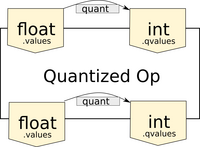

# FHE Op-graph design

The [ONNX import](onnx_pipeline.md) section gave an overview of the conversion of a generic ONNX graph to an FHE-compatible Concrete ML op-graph. This section describes the implementation of operations in the Concrete ML op-graph and the way floating point can be used in some parts of the op-graphs through table lookup operations.

## Float vs. quantized operations

Concrete, the underlying implementation of TFHE that powers Concrete ML, enables two types of operations on integers:

1. **arithmetic operations**: the addition of two encrypted values and multiplication of encrypted values with clear scalars. These are used, for example, in dot-products, matrix multiplication (linear layers), and convolution.
1. **table lookup operations (TLU)**: using an encrypted value as an index, return the value of a lookup table at that index. This is implemented using Programmable Bootstrapping. This operation is used to perform any non-linear computation such as activation functions, quantization, and normalization.

Since machine learning models use floating point inputs and weights, they first need to be converted to integers using [quantization](../quantization.md).

Alternatively, it is possible to use a table lookup to avoid the quantization of the entire graph, by converting floating-point ONNX subgraphs into lambdas and computing their corresponding lookup tables to be evaluated directly in FHE. This operator-fusion technique only requires the input and output of the lambdas to be integers.

For example, in the following graph there is a single input, which must be an encrypted integer tensor. The following series of univariate functions is then fed into a matrix multiplication (MatMul) and fused into a single table lookup with integer inputs and outputs.


## ONNX operations

Concrete ML implements ONNX operations using Concrete, which can handle floating point operations, as long as they can be fused to an integer lookup table. The ONNX operations implementations are based on the `QuantizedOp` class.

There are two modes of creation of a single table lookup for a chain of ONNX operations:

1. **float mode**: when the operation can be fused
1. **mixed float/integer**: when the ONNX operation needs to perform arithmetic operations

Thus, `QuantizedOp` instances may need to quantize their inputs or the result of their computation, depending on their position in the graph.

The `QuantizedOp` class provides a generic implementation of an ONNX operation, including the quantization of inputs and outputs, with the computation implemented in NumPy in `ops_impl.py`. It is possible to picture the architecture of the `QuantizedOp` as the following structure:



This figure shows that the `QuantizedOp` has a body that implements the computation of the operation, following the [ONNX spec](https://github.com/onnx/onnx/blob/main/docs/Operators.md). The operation's body can take either integer or float inputs and can output float or integer values. Two quantizers are attached to the operation: one that takes float inputs and produces integer inputs and one that does the same for the output.

### Operations that can fuse to a TLU

Depending on the position of the op in the graph and its inputs, the `QuantizedOp` can be fully fused to a TLU.


Many ONNX ops are trivially univariate, as they multiply variable inputs with constants or apply univariate functions such as ReLU, Sigmoid, etc. This includes operations between the input and the MatMul in the graph above (subtraction, comparison, multiplication, etc. between inputs and constants).

### Operations that work on integers

Operations, such as matrix multiplication of encrypted inputs with a constant matrix or convolution with constant weights, require that the encrypted inputs be integers. In this case, the input quantizer of the `QuantizedOp` is applied. These types of operations are implemented with a class that derives from `QuantizedOp` and implements `q_impl`, such as `QuantizedGemm` and `QuantizedConv`.


### Operations that produce graph outputs

Finally, some operations produce graph outputs, which must be integers. These operations need to quantize their outputs as follows:


The diagram above shows that both float ops and integer ops need to quantize their outputs to integers when placed at the end of the graph.

### Putting it all together

To chain the operation types described above following the ONNX graph, Concrete ML constructs a function that calls the `q_impl` of the `QuantizedOp` instances in the graph in sequence, and uses Concrete to trace the execution and compile to FHE. Thus, in this chain of function calls, all groups of that instruction that operate in floating point will be fused to TLUs. In FHE, this lookup table is computed with a PBS.


The red contours show the groups of elementary Concrete instructions that will be converted to TLUs.

Note that the input is slightly different from the `QuantizedOp`. Since the encrypted function takes integers as inputs, the input needs to be de-quantized first.

## Implementing a `QuantizedOp`

`QuantizedOp` is the base class for all ONNX-quantized operators. It abstracts away many things to allow easy implementation of new quantized ops.

### Determining if the operation can be fused

The `QuantizedOp` class exposes a function `can_fuse` that:

- helps to determine the type of implementation that will be traced.
- determines whether operations further in the graph, that depend on the results of this operation, can fuse.

In most cases, ONNX ops have a single variable input and one or more constant inputs.

When the op implements element-wise operations between the inputs and constants (addition, subtract, multiplication, etc), the operation can be fused to a TLU. Thus, by default in `QuantizedOp`, the `can_fuse` function returns `True`.

When the op implements operations that mix the various scalars in the input encrypted tensor, the operation cannot fuse, as table lookups are univariate. Thus, operations such as `QuantizedGemm` and `QuantizedConv` return `False` in `can_fuse`.

Some operations may be found in both settings above. A mechanism is implemented in Concrete ML to determine if the inputs of a `QuantizedOp` are produced by a unique integer tensor. Therefore, the `can_fuse` function of some `QuantizedOp` types (addition, subtraction) will allow fusion to take place if both operands are produced by a unique integer tensor:

```python
def can_fuse(self) -> bool:
    return len(self._int_input_names) == 1
```

### Case 1: A floating point version of the op is sufficient

You can check `ops_impl.py` to see how some operations are implemented in NumPy. The declaration convention for these operations is as follows:

- The required inputs should be positional arguments only before the `/`, which marks the limit of the positional arguments.
- The optional inputs should be positional or keyword arguments between the `/` and `*`, which marks the limits of positional or keyword arguments.
- The operator attributes should be keyword arguments only after the `*`.

The proper use of positional/keyword arguments is required to allow the `QuantizedOp` class to properly populate metadata automatically. It uses Python inspect modules and stores relevant information for each argument related to its positional/keyword status. This allows using the Concrete implementation as specifications for `QuantizedOp`, which removes some data duplication and generates a single source of truth for `QuantizedOp` and ONNX-NumPy implementations.

In that case (unless the quantized implementation requires special handling like `QuantizedGemm`), you can just set `_impl_for_op_named` to the name of the ONNX op for which the quantized class is implemented (this uses the mapping `ONNX_OPS_TO_NUMPY_IMPL` in `onnx_utils.py` to get the correct implementation).

### Case 2: An integer implementation of the op is necessary

Providing an integer implementation requires sub-classing `QuantizedOp` to create a new operation. This sub-class must override `q_impl` in order to provide an integer implementation. `QuantizedGemm` is an example of such a case where quantized matrix multiplication requires proper handling of scales and zero points. The `q_impl` of that class reflects this.

In the body of `q_impl`, you can use the `_prepare_inputs_with_constants` function in order to obtain quantized integer values:

```python
from concrete.ml.quantization import QuantizedArray

def q_impl(
    self,
    *q_inputs: QuantizedArray,
    **attrs,
) -> QuantizedArray:

    # Retrieve the quantized inputs
    prepared_inputs = self._prepare_inputs_with_constants(
        *q_inputs, calibrate=False, quantize_actual_values=True
    )
```

Here, `prepared_inputs` will contain one or more `QuantizedArray`, of which the `qvalues` are the quantized integers.

Once the required integer processing code is implemented, the output of the `q_impl` function must be implemented as a single `QuantizedArray`. Most commonly, this is built using the de-quantized results of the processing done in `q_impl`.

<!--pytest-codeblocks:skip-->

```python
    result = (
        sum_result.astype(numpy.float32) - q_input.quantizer.zero_point
    ) * q_input.quantizer.scale

    return QuantizedArray(
        self.n_bits,
        result,
        value_is_float=True,
        options=self.input_quant_opts,
        stats=self.output_quant_stats,
        params=self.output_quant_params,
    )
```

### Case 3: Both a floating point and an integer implementation are necessary

In this case, in `q_impl` you can check whether the current operation can be fused by calling `self.can_fuse()`. You can then have both a floating-point and an integer implementation. The traced execution path will depend on `can_fuse()`:

<!--pytest-codeblocks:skip-->

```python

def q_impl(
    self,
    *q_inputs: QuantizedArray,
    **attrs,
) -> QuantizedArray:

    execute_in_float = len(self.constant_inputs) > 0 or self.can_fuse()

    # a floating point implementation that can fuse
    if execute_in_float:
        prepared_inputs = self._prepare_inputs_with_constants(
            *q_inputs, calibrate=False, quantize_actual_values=False
        )

        result = prepared_inputs[0] + self.b_sign * prepared_inputs[1]
        return QuantizedArray(
            self.n_bits,
            result,
            # ......
        )
    else:
        prepared_inputs = self._prepare_inputs_with_constants(
            *q_inputs, calibrate=False, quantize_actual_values=True
        )
        # an integer implementation follows, see Case 2
        # ....
```
