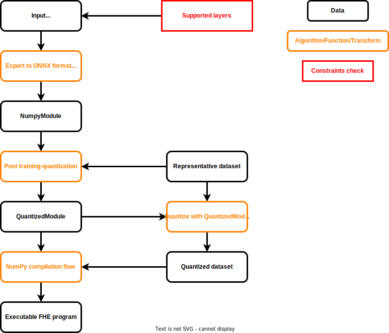

# Importing ONNX

Internally, Concrete ML uses [ONNX](https://github.com/onnx/onnx) operators as intermediate representation (or IR) for manipulating machine learning models produced through export for [PyTorch](https://github.com/pytorch/pytorch), [Hummingbird](https://github.com/microsoft/hummingbird), and [skorch](https://github.com/skorch-dev/skorch).

As ONNX is becoming the standard exchange format for neural networks, this allows Concrete ML to be flexible while also making model representation manipulation easy. In addition, it allows for straight-forward mapping to NumPy operators, supported by Concrete to use Concrete stack's FHE-conversion capabilities.

## Torch to NumPy conversion using ONNX

The diagram below gives an overview of the steps involved in the conversion of an ONNX graph to an FHE-compatible format (i.e., a format that can be compiled to FHE through Concrete).

All Concrete ML built-in models follow the same pattern for FHE conversion:

1. The models are trained with sklearn or PyTorch.
1. All models have a PyTorch implementation for inference. This implementation is provided either by a third-party tool such as [Hummingbird](external_libraries.md#hummingbird) or implemented directly in Concrete ML.
1. The PyTorch model is exported to ONNX. For more information on the use of ONNX in Concrete ML, see [here](onnx_pipeline.md#torch-to-numpy-conversion-using-onnx).
1. The Concrete ML ONNX parser checks that all the operations in the ONNX graph are supported and assigns reference NumPy operations to them. This step produces a `NumpyModule`.
1. Quantization is performed on the [`NumpyModule`](../../references/api/concrete.ml.torch.numpy_module.md#class-numpymodule), producing a [`QuantizedModule`](../../references/api/concrete.ml.quantization.quantized_module.md#class-quantizedmodule). Two steps are performed: calibration and assignment of equivalent [`QuantizedOp`](../../references/api/concrete.ml.quantization.base_quantized_op.md#class-quantizedop) objects to each ONNX operation. The `QuantizedModule` class is the quantized counterpart of the `NumpyModule`.
1. Once the `QuantizedModule` is built, Concrete is used to trace the `._forward()` function of the `QuantizedModule`.

Moreover, by passing a user provided `nn.Module` to step 2 of the above process, Concrete ML supports custom user models. See the associated [FHE-friendly model documentation](../../deep-learning/fhe_friendly_models.md) for instructions about working with such models.



Once an ONNX model is imported, it is converted to a `NumpyModule`, then to a `QuantizedModule` and, finally, to an FHE circuit. However, as the diagram shows, it is perfectly possible to stop at the `NumpyModule` level if you just want to run the PyTorch model as NumPy code without doing quantization.


Note that the `NumpyModule` interpreter currently [supports the following ONNX operators](../../deep-learning/onnx_support.md#supported-operators).


## Inspecting the ONNX models

In order to better understand how Concrete ML works under the hood, it is possible to access each model in their ONNX format and then either print it or visualize it by importing the associated file in [Netron](https://netron.app). For example, with `LogisticRegression`:

```python
import onnx
from sklearn.datasets import make_classification
from sklearn.model_selection import train_test_split

from concrete.ml.sklearn import LogisticRegression

# Create the data for classification
x, y = make_classification(n_samples=250, class_sep=2, n_features=30, random_state=42)

# Retrieve train and test sets
X_train, X_test, y_train, y_test = train_test_split(
    x, y, test_size=0.4, random_state=42
)

# Fix the number of bits to used for quantization
model = LogisticRegression(n_bits=8)

# Fit the model
model.fit(X_train, y_train)

# Access to the model
onnx_model = model.onnx_model

# Print the model
print(onnx.helper.printable_graph(onnx_model.graph))

# Save the model
onnx.save(onnx_model, "tmp.onnx")

# And then visualize it with Netron
```
