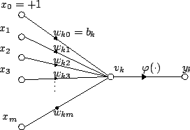
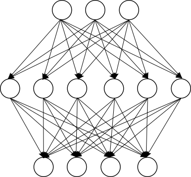
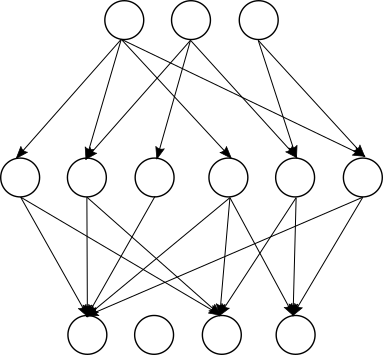

# Pruning

Pruning is a method to reduce neural network complexity, usually applied in order to reduce the computation cost or memory size. Pruning is used in Concrete ML to control the size of accumulators in neural networks, thus making them FHE-compatible. See [here](../getting-started/concepts.md#model-accuracy-considerations-under-fhe-constraints) for an explanation of accumulator bit-width constraints.

## Overview of pruning in Concrete ML

Pruning is used in Concrete ML for two types of neural networks:

1. Built-in [neural networks](../built-in-models/neural-networks.md) include a pruning mechanism that can be parameterized by the user. The pruning type is based on L1-norm. To comply with FHE constraints, Concrete ML uses _unstructured_ pruning, as the aim is not to eliminate neurons or convolutional filters completely, but to decrease their accumulator bit-width.
1. Custom neural networks, to work well under FHE constraints, should include pruning. When implemented with PyTorch, you can use the [framework's pruning mechanism](https://pytorch.org/tutorials/intermediate/pruning_tutorial.html) (e.g., L1-Unstructured) to good effect.

## Basics of pruning

In neural networks, a neuron computes a linear combination of inputs and learned weights, then applies an activation function.

The neuron computes:

$$y_k = \phi\left(\sum_i w_ix_i\right)$$

When building a full neural network, each layer will contain multiple neurons, which are connected to the inputs or to the neuron outputs of a previous layer.

For every neuron shown in each layer of the figure above, the linear combinations of inputs and learned weights are computed. Depending on the values of the inputs and weights, the sum $$v_k = \sum_i w_ix_i$$ - which for Concrete ML neural networks is computed with integers - can take a range of different values.

To respect the bit-width constraint of the FHE [table lookup](https://docs.zama.ai/concrete/tutorials/core-features/table_lookups), the values of the accumulator $$v_k$$ must remain small to be representable using a maximum of 16 bits. In other words, the values must be between 0 and $$2^{16}-1$$.

Pruning a neural network entails fixing some of the weights $$w_k$$ to be zero during training. This is advantageous to meet FHE constraints, as irrespective of the distribution of $$x_i$$, multiplying these input values by 0 does not increase the accumulator value.

Fixing some of the weights to 0 makes the network graph look more similar to the following:

While pruning weights can reduce the prediction performance of the neural network, studies show that a high level of pruning (above 50%) can often be applied. See here how Concrete ML uses pruning in [Fully Connected Neural Networks](../references/api/concrete.ml.sklearn.qnn.md#class-neuralnetclassifier).

## Pruning in practice

In the formula above, in the worst case, the maximum number of the input and weights that can make the result exceed $$n$$ bits is given by:

$$\Omega = \mathsf{floor} \left( \frac{2^{n_{\mathsf{max}}} - 1}{(2^{n_{\mathsf{weights}}} - 1)(2^{n_{\mathsf{inputs}}} - 1)} \right)$$

Here, $$n_{\mathsf{max}} = 16$$ is the maximum precision allowed.

For example, if $$n_{\mathsf{weights}} = 2$$ and $$n_{\mathsf{inputs}} = 2$$ with $$n_{\mathsf{max}} = 16$$, the worst case scenario occurs when all inputs and weights are equal to their maximal value $$2^2-1=3$$. There can be at most $$\Omega = 7281$$ elements in the multi-sums.

The distribution of the weights of a neural network is Gaussian, with many weights either 0 or having a small value. This enables exceeding the worst case number of active neurons without having to risk overflowing the bit-width. In built-in neural networks, the parameter `n_hidden_neurons_multiplier` is multiplied with $$\Omega$$ to determine the total number of non-zero weights that should be kept in a neuron.
