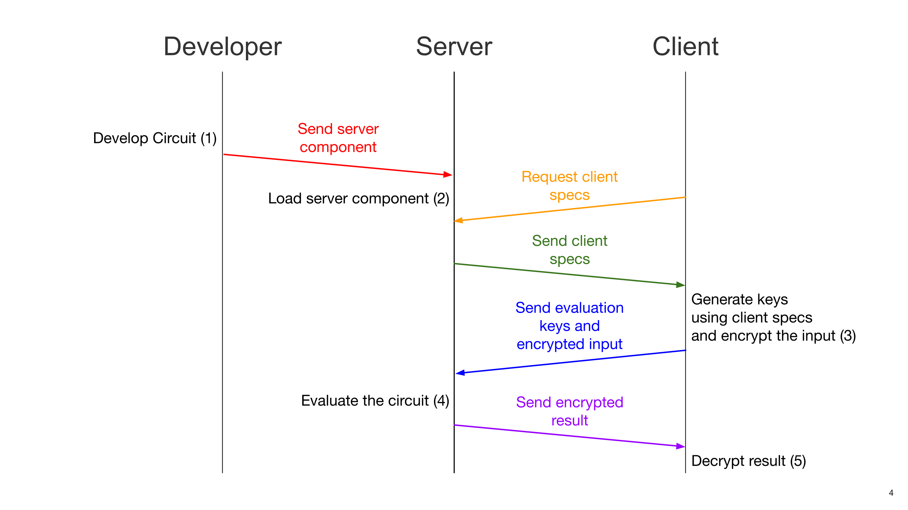

# Working in the cloud

Concrete ML models and data-frames can be easily deployed in a client/server setting, enabling the creation of privacy-preserving services in the cloud.

As seen in the [concepts section](concepts.md), once compiled to FHE, a Concrete ML model or data-frame generates machine code that execute prediction, training or pre-processing on encrypted data. _Secret_ encryption keys are needed so that the user can securely encrypt their data and decrypt the execution result. An _evaluation_ key is also needed for the server to securely process the user's encrypted data.

Keys are generated by the user _once_ for each service they use, based on the model the service provides and its cryptographic parameters.

The overall communications protocol to enable cloud deployment of machine learning services can be summarized in the following diagram:

The steps detailed above are:

1. The model developer deploys the compiled machine learning model to the server. This model includes the cryptographic parameters. The server is now ready to provide private inference. Crypto-graphic parameters and compiled programs for data-frames are included directly in Concrete ML.
1. The client requests the cryptographic parameters (also called "client specs"). Once it receives them from the server, the _secret_ and _evaluation_ keys are generated.
1. The client sends the _evaluation_ key to the server. The server is now ready to accept requests from this client. The client sends their encrypted data. Serialized data-frames include client evaluation keys.
1. The server uses the _evaluation_ key to securely run prediction, training and pre-processing on the user's data and sends back the encrypted result.
1. The client now decrypts the result and can send back new requests.

For more information on how to implement this basic secure inference protocol, refer to the [Production Deployment section](../guides/client_server.md) and to the [client/server example](../advanced_examples/ClientServer.ipynb). For information on training on encrypted data, see [the corresponding section](../built-in-models/training.md).
