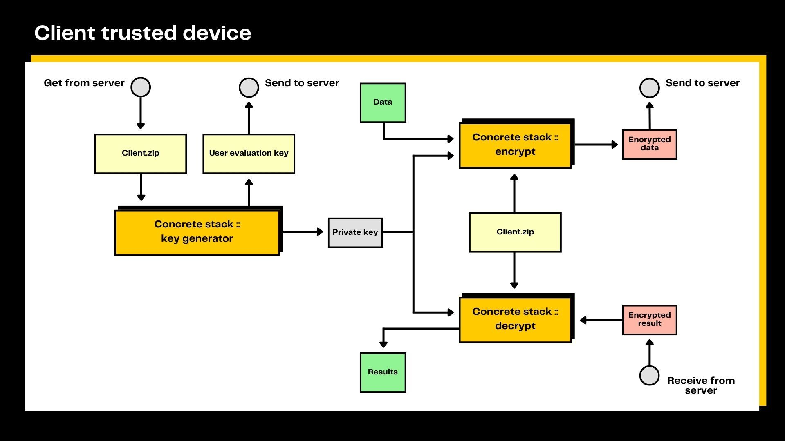

# Production Deployment

Concrete ML provides functionality to deploy FHE machine learning models in a client/server setting. The deployment workflow and model serving pattern is as follows:

## Deployment

The diagram above shows the steps that a developer goes through to prepare a model for encrypted inference in a client/server setting. The training of the model and its compilation to FHE are performed on a development machine. Three different files are created when saving the model:

- `client.zip` contains `client.specs.json` which lists the secure cryptographic parameters needed for the client to generate private and evaluation keys. It also contains `serialized_processing.json` which describes the pre-processing and post-processing required by the machine learning model, such as quantization parameters to quantize the input and de-quantize the output.
- `server.zip` contains the compiled model. This file is sufficient to run the model on a server. The compiled model is machine-architecture specific (i.e., a model compiled on x86 cannot run on ARM).

The compiled model (`server.zip`) is deployed to a server and the cryptographic parameters (`client.zip`) are shared with the clients. In some settings, such as a phone application, the `client.zip` can be directly deployed on the client device and the server does not need to host it.

Note that for built-in models, the server output + post-processing adheres to the following guidelines: if the model is a regressor, the output follows the format of the scikit-learn `.predict()` method; if the model is a classifier, the output follows the format of the scikit-learn `.predict_proba()` method.

## Serving

The client-side deployment of a secured inference machine learning model follows the schema above. First, the client obtains the cryptographic parameters (stored in `client.zip`) and generates a private encryption/decryption key as well as a set of public evaluation keys. The public evaluation keys are then sent to the server, while the secret key remains on the client.

The private data is then encrypted by the client as described in the `serialized_processing.json` file in `client.zip`, and it is then sent to the server. Server-side, the FHE model inference is run on encrypted inputs using the public evaluation keys.

The encrypted result is then returned by the server to the client, which decrypts it using its private key. Finally, the client performs any necessary post-processing of the decrypted result as specified in `serialized_processing.json` (part of `client.zip`).

The server-side implementation of a Concrete ML model follows the diagram above. The public evaluation keys sent by clients are stored. They are then retrieved for the client that is querying the service and used to evaluate the machine learning model stored in `server.zip`. Finally, the server sends the encrypted result of the computation back to the client.

## Example notebook

For a complete example, see [the client-server notebook](../advanced_examples/ClientServer.ipynb) or [the use-case examples](../../use_case_examples/deployment/).

### AWS

We provide scripts that leverage `boto3` to deploy any Concrete ML model to AWS.
The first required step is to properly set up AWS CLI on your system, which can be done by following the instructions in [AWS Documentation](https://docs.aws.amazon.com/cli/latest/userguide/cli-configure-files.html).
To create Access keys to configure AWS CLI, go to the [appropriate panel on AWS website](https://us-east-1.console.aws.amazon.com/iamv2/home?region=us-east-1#/security_credentials?section=IAM_credentials).

Once this first setup is done you can launch `python src/concrete/ml/deployment/deploy_to_aws.py --path-to-model <path_to_your_serialized_model>` from the root of the repository to create an instance that runs a FastAPI server serving the model.

### Docker

Running Docker with the latest version of Concrete ML will require you to build a Docker image. To do this, run the following command: `poetry build && mkdir pkg && cp dist/* pkg/ && make release_docker`. You will need to have `make`, `poetry` and `docker` installed on your system.
To test locally there is a dedicated script: `python src/concrete/ml/deployment/deploy_to_docker.py --path-to-model <path_to_your_serialized_model>` whoch should be run from the root of the repository in order to create a Docker that runs a FastAPI server serving the model.

No code is required to run the server but each client is specific to the use-case, even if the workflow stays the same.
To see how to create your client refer to our [examples](../../use_case_examples/deployment) or [this notebook](../advanced_examples/Deployment.ipynb).
