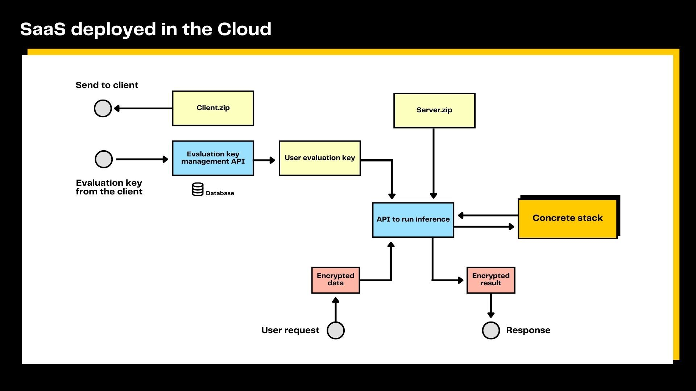

# Production Deployment

Concrete ML provides functionality to deploy FHE machine learning models in a client/server setting. The deployment workflow and model serving pattern is as follows:

## Deployment


The diagram above shows the steps that a developer goes through to prepare a model for encrypted inference in a client/server setting. The training of the model and its compilation to FHE are performed on a development machine. Three different files are created when saving the model:

- `client.zip` contains `client.specs.json` which lists the secure cryptographic parameters needed for the client to generate private and evaluation keys. It also contains `serialized_processing.json` which describes the pre-processing and post-processing required by the machine learning model, such as quantization parameters to quantize the input and de-quantize the output.
- `server.zip` contains the compiled model. This file is sufficient to run the model on a server. The compiled model is machine-architecture specific (i.e., a model compiled on x86 cannot run on ARM).

The compiled model (`server.zip`) is deployed to a server and the cryptographic parameters (`client.zip`) are shared with the clients. In some settings, such as a phone application, the `client.zip` can be directly deployed on the client device and the server does not need to host it.

> **Important Note:** In a client-server production using FHE, the server's output format depends on the model type. For regressors, the output matches the `predict()` method from scikit-learn, providing direct predictions. For classifiers, the output uses the `predict_proba()` method format, offering probability scores for each class, which allows clients to determine class membership by applying a threshold (commonly 0.5).

### Using the API Classes

The `FHEModelDev`, `FHEModelClient`, and `FHEModelServer` classes in the `concrete.ml.deployment` module make it easy to deploy and interact between the client and server:

- **`FHEModelDev`**: Use the `save` method of this class during the development phase to prepare and save the model artifacts (`client.zip` and `server.zip`). This class handles the serialization of the underlying FHE circuit as well as the crypto-parameters used for generating the keys. By changing the `mode` parameter of the `save` method, you can deploy a trained model or a [training FHE program](../built-in-models/training.md).

- **`FHEModelClient`**: This class is used on the client side to generate and serialize the cryptographic keys, encrypt the data before sending it to the server, and decrypt the results received from the server. It also handles the loading of quantization parameters and pre/post-processing from `serialized_processing.json`.

- **`FHEModelServer`**: This class is used on the server side to load the FHE circuit from `server.zip` and execute the model on encrypted data received from the client.

### Example Usage

```python
from concrete.ml.sklearn import DecisionTreeClassifier
from concrete.ml.deployment import FHEModelDev, FHEModelClient, FHEModelServer
import numpy as np

# Define the directory for FHE client/server files
fhe_directory = '/tmp/fhe_client_server_files/'

# Initialize the Decision Tree model
model = DecisionTreeClassifier()

# Generate some random data for training
X = np.random.rand(100, 20)
y = np.random.randint(0, 2, size=100)

# Train and compile the model
model.fit(X, y)
model.compile(X)

# Setup the development environment
dev = FHEModelDev(path_dir=fhe_directory, model=model)
dev.save()

# Setup the client
client = FHEModelClient(path_dir=fhe_directory, key_dir="/tmp/keys_client")
serialized_evaluation_keys = client.get_serialized_evaluation_keys()

# Client pre-processes new data
X_new = np.random.rand(1, 20)
encrypted_data = client.quantize_encrypt_serialize(X_new)

# Setup the server
server = FHEModelServer(path_dir=fhe_directory)
server.load()

# Server processes the encrypted data
encrypted_result = server.run(encrypted_data, serialized_evaluation_keys)

# Client decrypts the result
result = client.deserialize_decrypt_dequantize(encrypted_result)
```

> **Data Transfer Overview:**
>
> - **From Client to Server:** `serialized_evaluation_keys` (once), `encrypted_data`.
> - **From Server to Client:** `encrypted_result`.

These objects are serialized into bytes to streamline the data transfer between the client and server.

## Serving


The client-side deployment of a secured inference machine learning model follows the schema above. First, the client obtains the cryptographic parameters (stored in `client.zip`) and generates a private encryption/decryption key as well as a set of public evaluation keys. The public evaluation keys are then sent to the server, while the secret key remains on the client.

The private data is then encrypted by the client as described in the `serialized_processing.json` file in `client.zip`, and it is then sent to the server. Server-side, the FHE model inference is run on encrypted inputs using the public evaluation keys.

The encrypted result is then returned by the server to the client, which decrypts it using its private key. Finally, the client performs any necessary post-processing of the decrypted result as specified in `serialized_processing.json` (part of `client.zip`).



The server-side implementation of a Concrete ML model follows the diagram above. The public evaluation keys sent by clients are stored. They are then retrieved for the client that is querying the service and used to evaluate the machine learning model stored in `server.zip`. Finally, the server sends the encrypted result of the computation back to the client.

## Example notebook

For a complete example, see [the client-server notebook](../advanced_examples/ClientServer.ipynb) or [the use-case examples](../../use_case_examples/deployment/).
