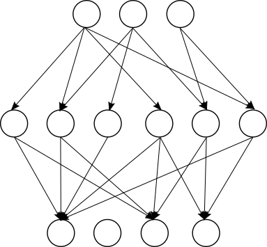

# Pruning

In neural networks, a neuron computes a linear combination of inputs and learned weights, then applies an activation function.

|                                       |
| :--------------------------------------------------------------------------------------: |
| *Artificial Neuron (from: [wikipedia](https://en.wikipedia.org/wiki/Artificial_neuron))* |
|                                                                                          |

The neuron computes:

$y_k = \phi\left(\sum_i w_ix_i\right)$

When building a full neural network, each layer will contain multiple neurons, which are connected to the neuron outputs of a previous layer or to the inputs.

|  |
| :------------------------------------: |
|    *Fully Connected Neural Network*    |
|                                        |

For every neuron shown in each layer of the figure above, the linear combinations of inputs and learned weights are computed. Depending on the values of the inputs and weights, the sum $v_k = \sum_i w_ix_i$ - which, for **Concrete-ML** neural networks, is computed with integers - can take a range of different values.

To respect the bit width constraint of the [Table Lookup](https://docs.zama.ai/concrete-numpy/stable/user/tutorial/table_lookup.html) mechanism, implemented with programmable bootstrapping, the values of the accumulator $v_k$ must remain small to be representable with only 8 bits. In other words, the values must be between 0 and 255.

Pruning a neural network entails fixing some of the weights $w_k$ to be zero during training. This is advantageous to meet FHE constraints, as, irrespective of the distribution of $x_i$, multiplying these input values by 0 does not increase the accumulator value.

Fixing some of the weights to 0 makes the network graph look more similar to the following:

|  |
| :--------------------------------------: |
| *Pruned Fully Connected Neural Network*  |
|                                          |

Pruning weights can reduce the prediction performance of the neural network, but studies show that a high level of pruning (above 50% [^1]) can be applied. In **Concrete-ML**, we implement [Fully Connected Neural Networks](_apidoc/concrete.ml.sklearn.html#concrete.ml.sklearn.qnn.NeuralNetClassifier) with pruning, as described in the [developer guide](skorch_usage.md).

[^1]: Han, Song & Pool, Jeff & Tran, John & Dally, William. (2015). Learning both Weights and Connections for Efficient Neural Networks.
