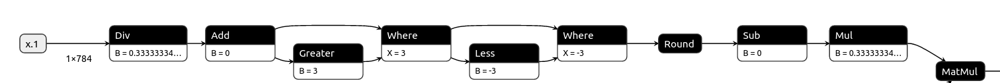
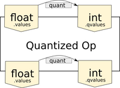
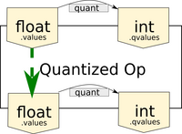
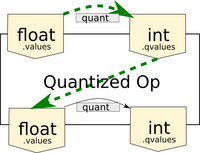
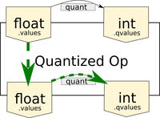
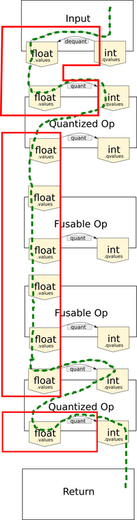

# FHE compatible ML op-graphs

The [ONNX import](onnx.md) section gave an overview of the conversion of a generic ONNX graph to an FHE compatible **Concrete-ML** op-graph. This section describes the implementation of the operations in the **Concrete-ML**  op-graph and the way floating point can be used in some parts of the op-graphs through table lookup operations.

## Float vs. quantized operations

In machine learning, we make use of two types of elementary FHE operations provided by **Concrete-Framework**, the underlying implementation of TFHE that powers **Concrete-ML**. Note that both of these types of operation work **only on integers**.

- _arithmetic operations_: addition of two encrypted values and multiplication of encrypted values with clear scalars. These are used for example in dot-products, matrix multiplication (linear layers), and convolution
- _table lookup operations_ (TLU): using an encrypted value as an index, return the value of a lookup table at that index. This is implemented using Programmable Bootstrapping (PBS). This operation is used to perform any non-linear computation such as activation functions, quantization, normalization

Furthermore, as discussed in [the FHE constraints section](fhe_constraints.md), the computation graph input and output need to be integers, as only integers are supported for encryption.

Machine Learning computation graphs use floating point inputs and weights. To convert them to integer computations, we use [quantization](quantization.md).

However, since we have a table lookup mechanism, it is possible to avoid the quantization of the entire graph. Indeed, the FHE datatype constraint requires that arithmetic operations, the first category in the list above, need to operate on integers. The most common arithmetic ONNX operations of use in machine learning are matrix multiplication, convolution, and addition of two tensors. All other ONNX operations, which implement univariate functions, need to have integer inputs and outputs to meet the FHE datatype constraint. But we observe that we can extend this rule to **sub-graphs of univariate ONNX operations**, meaning that the sub-graphs can have integer input and outputs, but their computations can be done in floating point. This is due to the float operation graph fusion in **Concrete-Numpy** as explained below.

An opportunity to avoid un-necessary quantization, which induces accuracy loss, can be identified for the case of sub-graphs of float univariate operations.

Let's examine the following operation graph:



The graph has a single input, which must be an encrypted integer tensor. Next, a series of univariate operations are applied. Finally, the result of this chain of univariate operations is fed into a matrix multiplication (MatMul). We observe that all the operations between the input and the MatMul operation can be fused into a single table lookup with integer inputs and outputs. Therefore the computation of these operations can be implemented in floating point.

## Concrete-ML ONNX operation implementation

**Concrete-ML** implements ONNX operations using **Concrete-Numpy**, which can handle floating point operations, as long as they can be fused to an integer lookup table, as [explained here](https://docs.zama.ai/concrete-numpy/stable/user/tutorial/working_with_floating_points.html). The ONNX op implementations are based on the `QuantizedOp` class.

To allow the creation of a single table lookup for a chain of ONNX operations, two operating modes of these operations is established:

- float mode: when the operation can be fused
- mixed float - integer: when the ONNX op needs to perform _arithmetic operations_ as described above

Thus, `QuantizedOp` instances may need to quantize their inputs or the result of their computation, depending on their position in the graph.

The `QuantizedOp` class provides a generic implementation of an ONNX operation, including quantization of inputs and outputs, with the computation implemented in numpy in `ops_impl.py`. We can picture at the architecture of the `QuantizedOp` as the following structure:



We can see in this figure that the `QuantizedOp` has a body, which implements the computation of the operation, following the [ONNX spec](https://github.com/onnx/onnx/blob/main/docs/Operators.md). The op body can take either integer or float inputs and can output float or integer values. Two quantizers are attached to the op, one that takes float inputs and produces the integer inputs, and one that does the same for the output.

### Operations that can fuse to a TLU

Depending on the position of the op in the graph and its inputs, the `QuantizedOp` can be fully fused to a TLU. In this case we can represent this as in the following diagram:



Many ONNX ops are trivially univariate, as they multiply variable inputs with constants, or apply univariate functions such as ReLU, Sigmoid, etc. The operations between the input and the MatMul in the graph above are of this type: subtraction, comparison, multiplication, etc. between inputs and constants.

### Operations that work on integers

Operations such as matrix multiplication of encrypted inputs with a constant matrix, or convolution with constant weights, require that the encrypted inputs be integers. In this case, the input quantizer of the `QuantizedOp` is applied. These types of operation are implemented with a class that derives from `QuantizedOp` and implements `q_impl`, such as `QuantizedGemm` and `QuantizedConv`. We can picture the computation flow of these operations as follows:

follows:



### Operations that produce graph outputs

Finally, some operations produce graph outputs which must be integers. These operations thus need to quantize their outputs as follows:




The diagram above shows that both float ops and integer ops need to quantize their outputs to integer, when placed at the end of the graph.

### Putting it all together

To chain the operation types described above, following the ONNX graph, **Concrete-ML** constructs a function that calls the `q_impl` of the `QuantizedOp` instances in the graph in sequence, and uses **Concrete-Numpy** to trace the execution and compile to FHE. Thus, in this chain of function calls, all groups of that instructions that operate in floating point will be fused to table lookups (TLUs). In FHE this lookup table is computed with a PBS.



The red contours show the groups of elementary **Concrete Numpy** instructions that will be converted to TLUs.

Note that the input is slightly different from the `QuantizedOp`. Since the encrypted function takes integers as inputs, the input needs to be dequantized first.

## Implementing a `QuantizedOp`

`QuantizedOp` is the base class for all ONNX quantized operators. It abstracts away many things to allow easy implementation of new quantized ops.

### Determining if the operation can be fused

The `QuantizedOp` class exposes a function `can_fuse` that

- helps to determine the type of implementation that will be traced
- determines whether operations further in the graph, that depend on the results of this operation, can fuse

In most case ONNX ops have a single variable input and one or more constant inputs.

When the op implements elementwise operations between the inputs and constants (addition, subtract, multiplication, etc),
the operation can be fused to a TLU. Thus, by default in `QuantizedOp` the `can_fuse` function returns `True`.

When the op implements operations that mix the various scalars in the input encrypted tensor, the operation can not fuse,
as table lookups are univariate. Thus operations such as `QuantizedGemm`, `QuantizedConv` return `False` in `can_fuse`.

Some operations may be found in both settings above. A mechanism is implemented in **Concrete-ML** to determine if the inputs of a `QuantizedOp`
are produced by a unique integer tensor. Thus, the `can_fuse` function of some `QuantizedOp` types (addition, subtraction) will allow fusion
to take place if both operands are produced by a unique integer tensor:

```python
def can_fuse(self) -> bool:
    return len(self._int_input_names) == 1
```

### Case 1: A floating point version of the op is sufficient

You can check `ops_impl.py` to see how some operations are implemented in with NumPy. The declaration convention for these operations is as follows:

- The required inputs should be positional arguments only before the `/`, which marks the limit of the positional arguments
- The optional inputs should be positional or keyword arguments between the `/` and `*`, which marks the limits of positional or keyword arguments
- The operator attributes should be keyword arguments only after the `*`

The proper use of positional/keyword arguments is required to allow the `QuantizedOp` class to properly populate metadata automatically. It uses Python inspect modules and stores relevant information for each argument related to its positional/keyword status. This allows us to use our NumPy implementation as specifications for `QuantizedOp`, which removes some data duplication and allows us to have a single source of truth for `QuantizedOp` and ONNX NumPy implementations.

In that case (unless the quantized implementation requires special handling like `QuantizedGemm`), you can just set `_impl_for_op_named` to the name of the ONNX op for which the quantized class is implemented (this uses the mapping `ONNX_OPS_TO_NUMPY_IMPL` we have in `onnx_utils.py` to get the right implementation).

### Case 2: An integer implementation of the op is necessary

If you want to provide an integer implementation, you need to sub-class `QuantizedOp` to create a new operation. This sub-class must override `q_impl` in order to provide an integer implementation. `QuantizedGemm` is an example of such a case where quantized matrix multiplication requires proper handling of scales and zero points. The `q_impl` of that class reflects that.

In the body of `q_impl`, in order to obtain quantized integer values you can use the `_prepare_inputs_with_constants` function as such:

```python
from concrete.ml.quantization import QuantizedArray

def q_impl(
    self,
    *q_inputs: QuantizedArray,
    **attrs,
) -> QuantizedArray:

    # Retrieve the quantized inputs
    prepared_inputs = self._prepare_inputs_with_constants(
        *q_inputs, calibrate=False, quantize_actual_values=True
    )
```

Now, `prepared_inputs` will contain one or more `QuantizedArray` of which the `qvalues` are the quantized integers.

Once you implemented the required processing code on integers, the output of the `q_impl` function must be a
single `QuantizedArray`. Most commonly, this is built using the dequantized results of the processing done in `q_impl`.

<!--pytest-codeblocks:skip-->

```python
result = (
    sum_result.astype(numpy.float32) - q_input.quantizer.zero_point
) * q_input.quantizer.scale

return QuantizedArray(
    self.n_bits,
    result,
    value_is_float=True,
    options=self.input_quant_opts,
    stats=self.output_quant_stats,
    params=self.output_quant_params,
)
```

### Case 3: Both a floating point and an integer implementation are necessary

In this case, in `q_impl` you can check wether the current operation can be fused by calling `self.can_fuse()`.
You can then have both a floating point and an integer implementation, the traced execution path will depend on `can_fuse()`:

<!--pytest-codeblocks:skip-->

```python
execute_in_float = len(self.constant_inputs) > 0 or self.can_fuse()

# a floating point implementation that can fuse
if execute_in_float:
    prepared_inputs = self._prepare_inputs_with_constants(
        *q_inputs, calibrate=False, quantize_actual_values=False
    )

    result = prepared_inputs[0] + self.b_sign * prepared_inputs[1]
    return QuantizedArray(
        self.n_bits,
        result,
        # ......
    )
# an integer implementation follows, see Case 2
# ....
```
