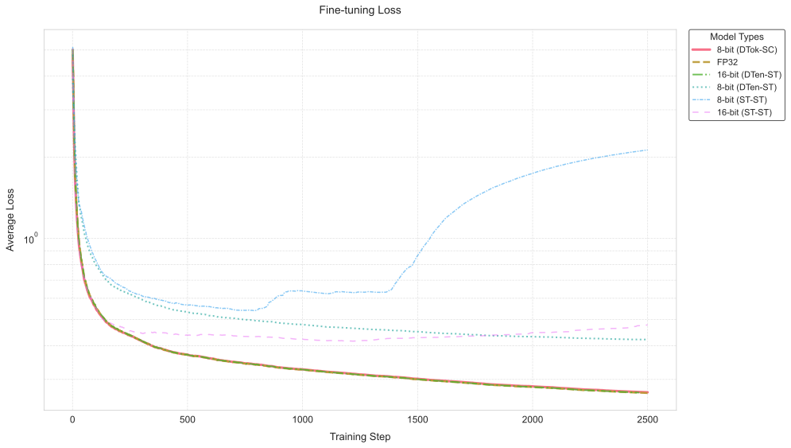

# Privacy Preserving Language Models LoRA Fine-tuning

This use case demonstrates how to fine-tune language models (GPT-2 and LLaMA) using Low-Rank Adaptation (LoRA) weights with Fully Homomorphic Encryption (FHE). The goal is to train specialized models in a privacy-preserving manner, with minimal memory requirements.

## Overview

Fine-tuning large language models typically requires access to sensitive data, which can raise privacy concerns. By leveraging FHE, we can perform computations on encrypted foundation model weights, ensuring that the data remain private throughout the training process. The LoRA weights are kept in clear on the client side.

## Key Features

- **LoRA Fine-Tuning**: Fine-tune language models by adapting low-rank weights
- **Hybrid Model**: Combine encrypted foundation model weights with clear LoRA weights for optimal performance
- **Low Memory Requirements**: Minimal client-side memory needed for LoRA weights
- **Multiple Approaches**:
  - Custom training implementation for GPT-2
  - Simplified API-based approach for LLaMA using the `LoraTrainer`

## Setup

### Installation

Install the required packages:

<!--pytest-codeblocks:skip-->

```sh
pip install -r requirements.txt
```

## Usage

### Available Notebooks

The repository includes two example notebooks:

1. **GPT2FineTuneHybrid.ipynb**:

   - Uses a custom training implementation
   - Fine-tunes GPT-2 on a small Q&A data-set about FHE
   - Shows low-level control over the training process

1. **LLamaFineTuning.ipynb**:

   - Uses Concrete ML's `LoraTrainer` API for simplified implementation
   - Fine-tunes LLaMA on Concrete ML code examples
   - Shows how to use the high-level API for encrypted fine-tuning

### Prepare the data-set

Each notebook includes its own data-set:

- GPT-2 uses a small Q&A data-set about FHE in `data_finetune/what_is_fhe.txt`
- LLaMA uses Concrete ML code examples in `data_finetune/data-set.jsonl`

### Run the Fine-Tuning Script

Execute the Jupyter notebook `GPT2FineTuneHybrid.ipynb` to start the fine-tuning process. The notebook is structured into several steps:

### Evaluation Script

The repository includes an evaluation script (`eval.py`) that allows you to train, evaluate and compare the LLaMA model training with different modes:

<!--pytest-codeblocks:skip-->

```sh
python eval.py --mode [torch|8bit|16bit]
```

The script supports three modes:

- `torch`: Regular PyTorch training without quantization
- `8bit`: Training with 8-bit quantization
- `16bit`: Training with 16-bit quantization

The script will:

1. Train the model on a math word problems dataset
1. Generate evaluation metrics and sample responses
1. Save the results in mode-specific files:
   - Training logs: `training_log_{mode}.txt`
   - Generated responses: `eval_generated_responses_{mode}.txt`
   - Model weights: `deployment/llama_lora_finetuned_{mode}/`

## Deployment/Production Scenario

In a deployment or production scenario, the model can be fine-tuned as follows:

1. **Server Setup**: The server hosts a foundation model with generic weights.
1. **Client Setup**: The user (client) has a set of LoRA weights and the sensitive data required for fine-tuning.
1. **Fine-Tuning Process**:
   - The client requests inference and backward passes from the server, which uses the generic weights/parameters.
   - Any computation that requires the LoRA weights is executed on the client's end.
1. **Storage**: The LoRA weights are stored on the client's end for later inference, ensuring full privacy of both the specialized model and the sensitive data.

## Results

### GPT-2 Results

After fine-tuning, the model's weights are distributed between the client and server as follows:

- Total weights removed from the server: 68.24%
- LoRA weights kept on the client: 147,456 (approximately 0.12% of the original model's weights)

Note that the embeddings are not considered for now but contain a significant amount of weights (around 30%) for GPT2. They will be considered in a future version of Concrete ML.

#### Training Results Visualization



*LoRA Fine-tuning Quantized Loss Comparison*

- **FP32**: Full precision (32-bit floating point) baseline training
- **ST-ST**: Static per-Tensor quantization with fixed ranges
  - Input: Static per-Tensor quantization
  - Weight: Static per-Tensor quantization
- **DTen-ST**: Dynamic/Static hybrid quantization
  - Input: Dynamic per-Tensor quantization
  - Weight: Static per-Tensor quantization
- **DTok-SC**: Dynamic quantization with finer granularity
  - Input: Dynamic per-Token quantization
  - Weight: Static per-Channel quantization

#### Final Training Losses (Step 2500)

| Model Configuration | Final Loss                                            |
| ------------------- | ----------------------------------------------------- |
| 8-bit (ST-ST)       | 2.1290                                                |
| 16-bit (ST-ST)      | 0.4776                                                |
| 8-bit (DTen-ST)     | 0.4215                                                |
| 16-bit (DTen-ST)    | <span style="background-color: #e6ffe6">0.2681</span> |
| FP32 (Baseline)     | <span style="background-color: #e6ffe6">0.2670</span> |
| 8-bit (DTok-SC)     | <span style="background-color: #e6ffe6">0.2688</span> |

Dynamic quantization is necessary in the backpropagation step to avoid *gradient explosion*. And per-token / per-channel quantization makes the 8-bit models match the performance of the 32-bit models.

## Conclusion

This project showcases the potential of combining LoRA and FHE to fine-tune language models in a privacy-preserving manner. By following the steps outlined in the notebook, you can adapt this approach to your own data-sets and use cases.

## References

- [LoRA: Low-Rank Adaptation of Large Language Models](https://arxiv.org/abs/2106.09685)
- [PEFT](https://github.com/huggingface/peft)
- [Concrete ML](https://github.com/zama-ai/concrete-ml)
